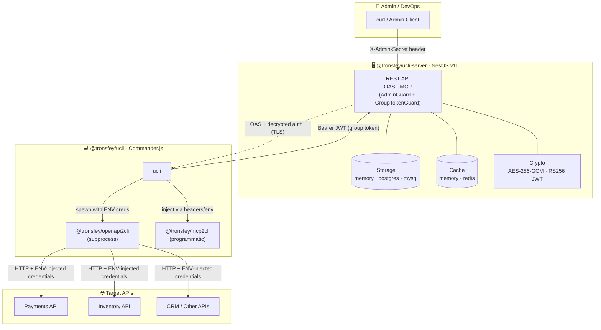
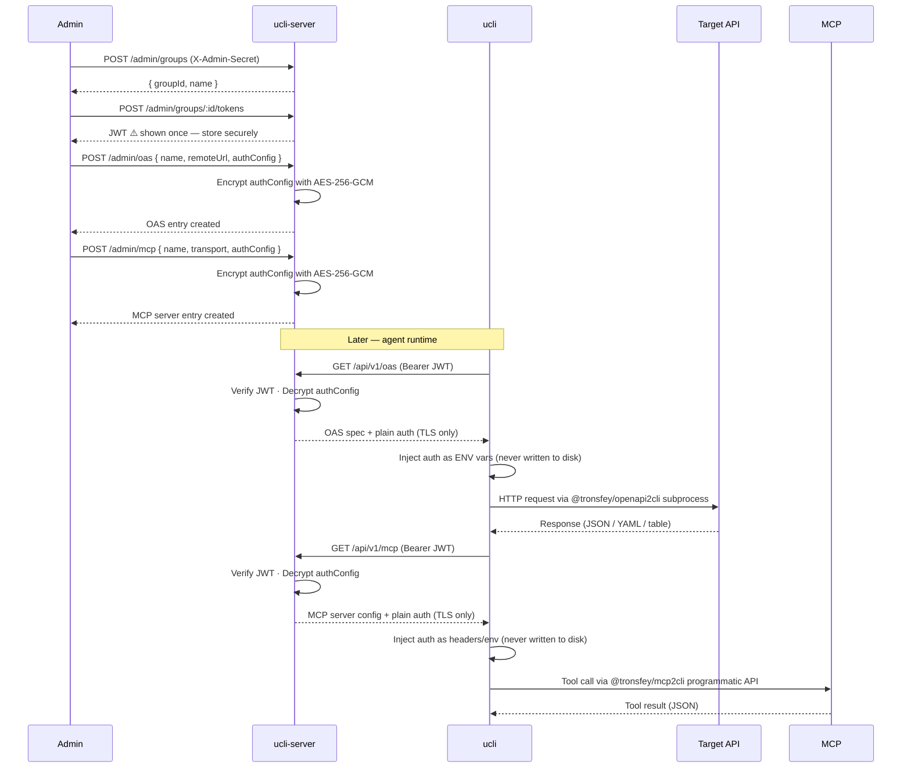

<h1 align="center">ucli</h1>

<p align="center">
  <a href="https://www.npmjs.com/package/@tronsfey/ucli-server"></a>
  <a href="https://www.npmjs.com/package/@tronsfey/ucli"></a>
  
  
</p>

<p align="center">
  English | <a href="./README.zh.md">中文</a>
</p>

---

## What is ucli?

**ucli** is a centralized [OpenAPI Specification](https://swagger.io/specification/) and [MCP Server](https://modelcontextprotocol.io/) management system built with a client/server architecture.

- The **server** (`@tronsfey/ucli-server`) stores OpenAPI specs and **MCP server configs** (Model Context Protocol) with **encrypted auth configs** (AES-256-GCM) and issues **group-scoped JWTs** (RS256).
- The **CLI** (`@tronsfey/ucli`) lets AI agents discover and invoke API operations and MCP tools **without ever seeing credentials** — auth is injected as environment variables or headers at runtime.

## Architecture



## Auth Flow



## Repository Structure

```
ucli/
├── README.md                        # This file (English)
├── README.zh.md                     # Chinese docs
├── CLAUDE.md                        # AI assistant guidance
├── assets/
│   └── logo.svg                     # Brand logo
├── package.json                     # pnpm workspace root
├── tsconfig.base.json               # Shared TS config
├── docker-compose.yml               # PostgreSQL + Redis for local dev
└── packages/
    ├── server/                      # @tronsfey/ucli-server (NestJS v11)
    │   ├── src/
    │   │   ├── auth/                # AdminGuard + GroupTokenGuard
    │   │   ├── cache/               # Pluggable cache (memory | redis)
    │   │   ├── config/              # Joi-validated env vars
    │   │   ├── crypto/              # JwtService (RS256) + EncryptionService (AES-256-GCM)
    │   │   ├── groups/              # Group management
    │   │   ├── health/              # Liveness + readiness probes
    │   │   ├── metrics/             # Prometheus export
    │   │   ├── oas/                 # OAS CRUD (admin + client)
    │   │   ├── mcp/                 # MCP Server CRUD (admin + client)
    │   │   ├── storage/             # Pluggable storage (memory | postgres | mysql)
    │   │   └── tokens/              # Token issuance + revocation
    │   └── test/e2e/                # Jest E2E tests (memory adapters)
    └── cli/                         # @tronsfey/ucli (Commander.js + tsup/ESM)
        ├── src/
        │   ├── commands/            # configure, services, run, refresh, help, mcp
        │   └── lib/                 # server-client, cache, oas-runner, mcp-runner
        └── test/                    # Vitest unit tests
```

## Quick Start

**Step 1 — Start the server**

```bash
npm install -g @tronsfey/ucli-server

# Generate a 32-byte encryption key
node -e "console.log(require('crypto').randomBytes(32).toString('hex'))"

ADMIN_SECRET=my-secret ENCRYPTION_KEY=<64-hex> ucli-server
# → Listening on http://localhost:3000
```

**Step 2 — Register a service and issue a token**

```bash
# Create a group
GROUP=$(curl -s -X POST http://localhost:3000/admin/groups \
  -H "X-Admin-Secret: my-secret" \
  -H "Content-Type: application/json" \
  -d '{"name":"agents"}' | jq -r '.id')

# Issue a JWT (save this — shown once!)
JWT=$(curl -s -X POST http://localhost:3000/admin/groups/$GROUP/tokens \
  -H "X-Admin-Secret: my-secret" \
  -H "Content-Type: application/json" \
  -d '{"name":"agent-token"}' | jq -r '.token')

# Register an OAS entry
curl -s -X POST http://localhost:3000/admin/oas \
  -H "X-Admin-Secret: my-secret" \
  -H "Content-Type: application/json" \
  -d "{
    \"groupId\": \"$GROUP\",
    \"name\": \"petstore\",
    \"remoteUrl\": \"https://petstore3.swagger.io/api/v3/openapi.json\",
    \"authType\": \"none\",
    \"authConfig\": {\"type\":\"none\"}
  }"

# Register an MCP server
curl -s -X POST http://localhost:3000/admin/mcp \
  -H "X-Admin-Secret: my-secret" \
  -H "Content-Type: application/json" \
  -d "{
    \"groupId\": \"$GROUP\",
    \"name\": \"weather\",
    \"transport\": \"http\",
    \"serverUrl\": \"https://weather.mcp.example.com/sse\",
    \"authConfig\": {\"type\":\"none\"}
  }"
```

**Step 3 — Use the CLI**

```bash
npm install -g @tronsfey/ucli

ucli configure --server http://localhost:3000 --token $JWT
ucli services list
ucli run --service petstore --operation getPetById --params '{"petId": 1}'

# Use MCP servers
ucli mcp list
ucli mcp tools weather
ucli mcp run weather get_forecast --location "New York"
```

## Using with OpenClaw

[OpenClaw](https://docs.openclaw.ai/) is an open-source autonomous AI agent platform. You can integrate ucli as a skill so that OpenClaw agents can discover and invoke your registered APIs and MCP tools.

### Step 1 — Install and configure ucli

```bash
npm install -g @tronsfey/ucli
ucli configure --server https://your-ucli-server.example.com --token <group-jwt>
```

### Step 2 — Add the ucli skill to OpenClaw

Copy the bundled skill file into your OpenClaw skills directory:

```bash
# Find the installed skill.md
SKILL_PATH=$(node -e "console.log(require.resolve('@tronsfey/ucli/skill.md'))")

# Copy to OpenClaw skills directory
mkdir -p ~/.openclaw/skills/ucli
cp "$SKILL_PATH" ~/.openclaw/skills/ucli/SKILL.md
```

Or create the skill manually — add `~/.openclaw/skills/ucli/SKILL.md` with the following frontmatter header, then paste the content from [`packages/cli/skill.md`](./packages/cli/skill.md):

```markdown
---
name: ucli
description: Discover and invoke external OpenAPI services and MCP server tools via ucli.
tags: [api, openapi, mcp, tools]
---

(paste the content of skill.md here)
```

### Step 3 — (Optional) Register ucli-server as an MCP server

If your ucli-server also acts as an MCP proxy, you can register it directly in OpenClaw's `~/.openclaw/openclaw.json`:

```json
{
  "mcpServers": {
    "ucli-proxy": {
      "command": "npx",
      "args": ["-y", "@tronsfey/ucli", "mcp", "run", "your-mcp-server", "{{toolName}}"],
      "transport": "stdio"
    }
  }
}
```

### Step 4 — Use it

Once configured, the OpenClaw agent can:

```
> List available API services
  → Agent runs: ucli services list

> Call the petstore API to get pet #1
  → Agent runs: ucli run petstore getPetById --petId 1

> List MCP tools on the weather server
  → Agent runs: ucli mcp tools weather

> Get the weather forecast for New York
  → Agent runs: ucli mcp run weather get_forecast location="New York"
```

The agent handles service discovery, operation lookup, and credential injection automatically — credentials are **never exposed** to the agent.

## Using with Claude Desktop (macOS)

[Claude Desktop](https://claude.ai/download) on macOS supports MCP servers natively. You can expose any MCP server registered in ucli directly to Claude Desktop.

### Step 1 — Install and configure ucli

```bash
npm install -g @tronsfey/ucli
ucli configure --server https://your-ucli-server.example.com --token <group-jwt>
```

### Step 2 — Edit Claude Desktop config

Open `~/Library/Application Support/Claude/claude_desktop_config.json` (create it if it does not exist) and add your MCP servers under `mcpServers`:

```json
{
  "mcpServers": {
    "weather": {
      "command": "ucli",
      "args": ["mcp", "proxy", "weather"],
      "transport": "stdio"
    }
  }
}
```

Replace `"weather"` with the name of any MCP server you have registered in ucli (`ucli mcp list` to see available servers).

### Step 3 — Restart Claude Desktop

Quit and relaunch Claude Desktop. The registered MCP tools will appear automatically in the tool selector.

> **Credentials are never exposed.** ucli injects auth headers/env at runtime — Claude Desktop never sees your API keys or tokens.

## Packages

| Package | Description | Docs |
|---------|-------------|------|
| [`@tronsfey/ucli-server`](./packages/server) | NestJS server — storage, crypto, auth, REST API, admin dashboard | [README](./packages/server/README.md) |
| [`@tronsfey/ucli`](./packages/cli) | Commander.js CLI — service discovery, operation runner | [README](./packages/cli/README.md) |
| `@tronsfey/ucli-admin` *(private)* | React admin dashboard — bundled into `ucli-server` at `/admin-ui` | — |

## Development

```bash
# Prerequisites: Node.js ≥ 18, pnpm ≥ 9
pnpm install

# Run all tests (no DB/Redis required — uses memory adapters)
pnpm test

# Type-check both packages
pnpm lint

# Start server in dev mode (hot-reload)
cd packages/server
ADMIN_SECRET=dev-secret ENCRYPTION_KEY=$(node -e "console.log(require('crypto').randomBytes(32).toString('hex'))") pnpm dev
```

## CI / CD

### Continuous Integration

Every push to `main` and every pull request targeting `main` triggers the [CI workflow](.github/workflows/ci.yml), which runs:

1. `pnpm lint` — TypeScript type-check for all packages
2. `pnpm test` — server E2E tests + CLI unit tests (memory adapters, no external deps)

### Publishing to npm

Both `@tronsfey/ucli-server` and `@tronsfey/ucli` are published to the npm public registry automatically via the [Publish workflow](.github/workflows/publish.yml) whenever a **GitHub Release** is published.

#### Setup (one-time)

Add an npm access token as a repository secret named **`NPM_TOKEN`**:

1. Generate a token at <https://www.npmjs.com/settings/~/tokens> (select **Automation** type).
2. In the GitHub repository go to **Settings → Secrets and variables → Actions → New repository secret**.
3. Name: `NPM_TOKEN`, Value: the token from step 1.

#### Release process

1. Bump the version in the relevant `package.json` files (`packages/server/package.json` and/or `packages/cli/package.json`).
2. Commit and push to `main`.
3. Create a **GitHub Release** (tag it `vX.Y.Z` or any tag you choose, e.g. `server-v0.6.3`).
4. Publishing **both** packages to npm starts automatically once the release is published.

> `@tronsfey/ucli-admin` is `private: true` and is **never published** to npm — it is bundled into `@tronsfey/ucli-server` at build time.
