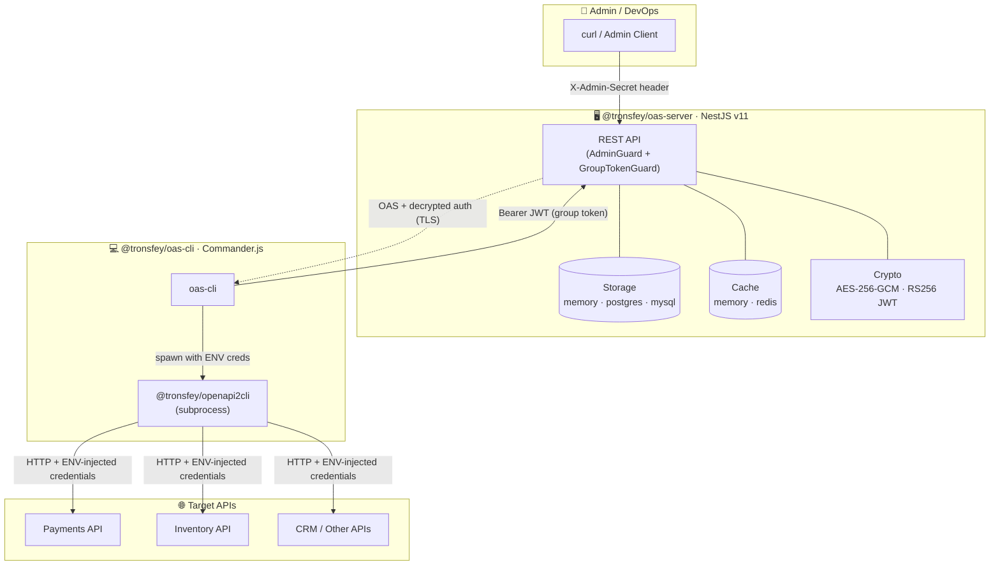
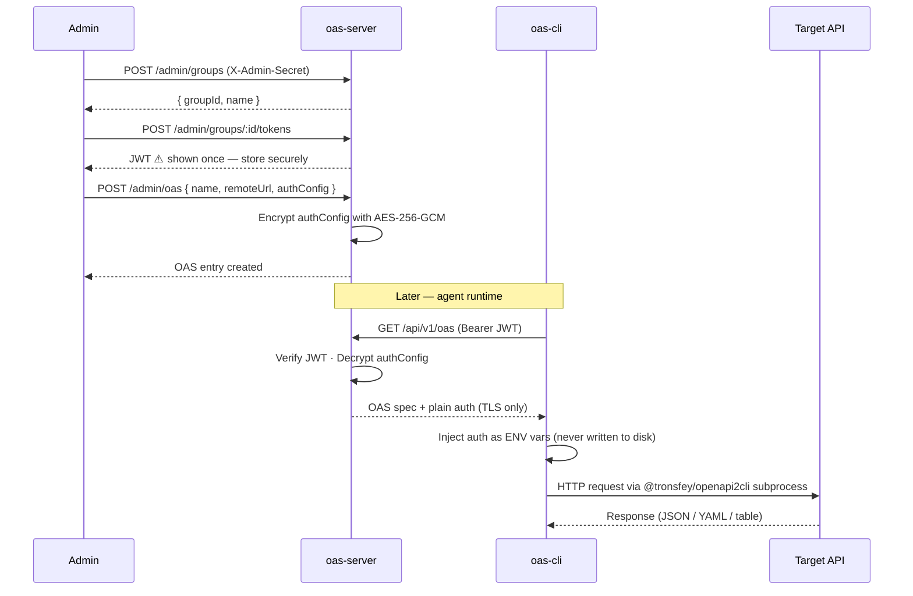

<h1 align="center">OAS Gateway</h1>

<p align="center">
  <a href="https://www.npmjs.com/package/@tronsfey/oas-server"></a>
  <a href="https://www.npmjs.com/package/@tronsfey/oas-cli"></a>
  
  
</p>

<p align="center">
  English | <a href="./README.zh.md">中文</a>
</p>

---

## What is OAS Gateway?

**OAS Gateway** is a centralized [OpenAPI Specification](https://swagger.io/specification/) management system built with a client/server architecture.

- The **server** (`@tronsfey/oas-server`) stores OpenAPI specs with **encrypted auth configs** (AES-256-GCM) and issues **group-scoped JWTs** (RS256).
- The **CLI** (`@tronsfey/oas-cli`) lets AI agents discover and invoke API operations **without ever seeing credentials** — auth is injected as environment variables at runtime.

## Architecture



## Auth Flow



## Repository Structure

```
fantastic-potato/
├── README.md                        # This file (English)
├── README.zh.md                     # Chinese docs
├── CLAUDE.md                        # AI assistant guidance
├── assets/
│   └── logo.svg                     # Brand logo
├── package.json                     # pnpm workspace root
├── tsconfig.base.json               # Shared TS config
├── docker-compose.yml               # PostgreSQL + Redis for local dev
└── packages/
    ├── server/                      # @tronsfey/oas-server (NestJS v11)
    │   ├── src/
    │   │   ├── auth/                # AdminGuard + GroupTokenGuard
    │   │   ├── cache/               # Pluggable cache (memory | redis)
    │   │   ├── config/              # Joi-validated env vars
    │   │   ├── crypto/              # JwtService (RS256) + EncryptionService (AES-256-GCM)
    │   │   ├── groups/              # Group management
    │   │   ├── health/              # Liveness + readiness probes
    │   │   ├── metrics/             # Prometheus export
    │   │   ├── oas/                 # OAS CRUD (admin + client)
    │   │   ├── storage/             # Pluggable storage (memory | postgres | mysql)
    │   │   └── tokens/              # Token issuance + revocation
    │   └── test/e2e/                # Jest E2E tests (memory adapters)
    └── cli/                         # @tronsfey/oas-cli (Commander.js + tsup/ESM)
        ├── src/
        │   ├── commands/            # configure, services, run, refresh, help
        │   └── lib/                 # server-client, cache, oas-runner
        └── test/                    # Vitest unit tests
```

## Quick Start

**Step 1 — Start the server**

```bash
npm install -g @tronsfey/oas-server

# Generate a 32-byte encryption key
node -e "console.log(require('crypto').randomBytes(32).toString('hex'))"

ADMIN_SECRET=my-secret ENCRYPTION_KEY=<64-hex> oas-server
# → Listening on http://localhost:3000
```

**Step 2 — Register a service and issue a token**

```bash
# Create a group
GROUP=$(curl -s -X POST http://localhost:3000/admin/groups \
  -H "X-Admin-Secret: my-secret" \
  -H "Content-Type: application/json" \
  -d '{"name":"agents"}' | jq -r '.id')

# Issue a JWT (save this — shown once!)
JWT=$(curl -s -X POST http://localhost:3000/admin/groups/$GROUP/tokens \
  -H "X-Admin-Secret: my-secret" \
  -H "Content-Type: application/json" \
  -d '{"name":"agent-token"}' | jq -r '.token')

# Register an OAS entry
curl -s -X POST http://localhost:3000/admin/oas \
  -H "X-Admin-Secret: my-secret" \
  -H "Content-Type: application/json" \
  -d "{
    \"groupId\": \"$GROUP\",
    \"name\": \"petstore\",
    \"remoteUrl\": \"https://petstore3.swagger.io/api/v3/openapi.json\",
    \"authType\": \"none\",
    \"authConfig\": {\"type\":\"none\"}
  }"
```

**Step 3 — Use the CLI**

```bash
npm install -g @tronsfey/oas-cli

oas-cli configure --server http://localhost:3000 --token $JWT
oas-cli services list
oas-cli run --service petstore --operation getPetById --params '{"petId": 1}'
```

## Packages

| Package | Description | Docs |
|---------|-------------|------|
| [`@tronsfey/oas-server`](./packages/server) | NestJS server — storage, crypto, auth, REST API, admin dashboard | [README](./packages/server/README.md) |
| [`@tronsfey/oas-cli`](./packages/cli) | Commander.js CLI — service discovery, operation runner | [README](./packages/cli/README.md) |
| `@tronsfey/oas-admin` *(private)* | React admin dashboard — bundled into `oas-server` at `/admin-ui` | — |

## Development

```bash
# Prerequisites: Node.js ≥ 18, pnpm ≥ 9
pnpm install

# Run all tests (no DB/Redis required — uses memory adapters)
pnpm test

# Type-check both packages
pnpm lint

# Start server in dev mode (hot-reload)
cd packages/server
ADMIN_SECRET=dev ENCRYPTION_KEY=$(node -e "console.log(require('crypto').randomBytes(32).toString('hex'))") pnpm dev
```
