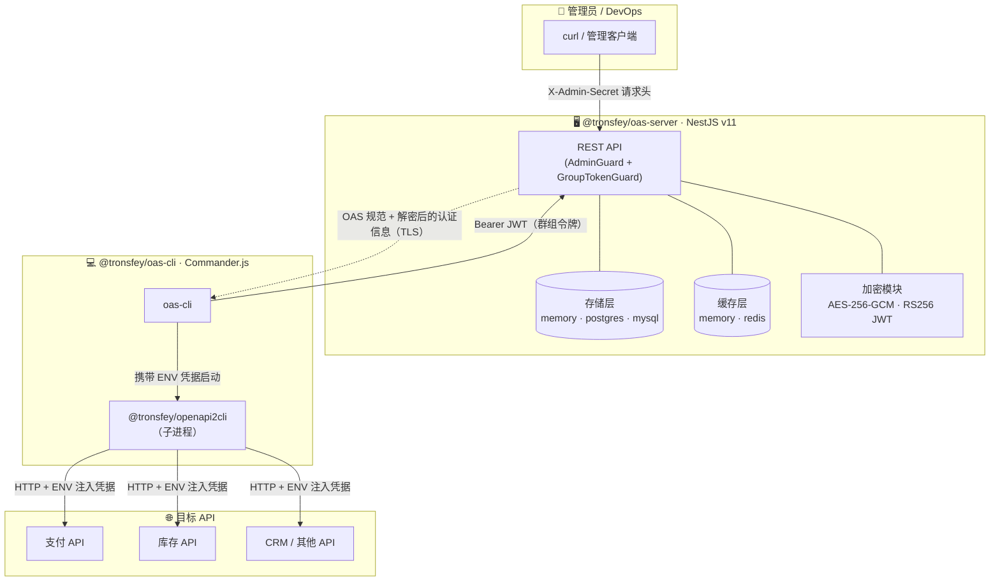
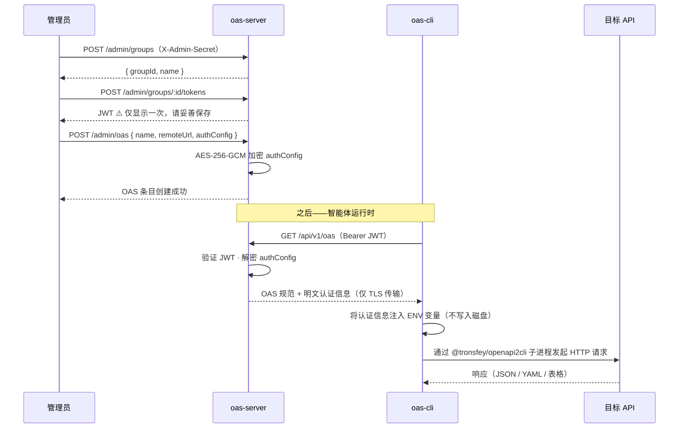

<h1 align="center">OAS Gateway</h1>

<p align="center">
  <a href="https://www.npmjs.com/package/@tronsfey/oas-server"></a>
  <a href="https://www.npmjs.com/package/@tronsfey/oas-cli"></a>
  
  
</p>

<p align="center">
  <a href="./README.md">English</a> | 中文
</p>

---

## OAS Gateway 是什么？

**OAS Gateway** 是一个基于客户端/服务端架构的 [OpenAPI Specification](https://swagger.io/specification/) 集中管理系统。

- **服务端**（`@tronsfey/oas-server`）以 **AES-256-GCM** 加密存储 OpenAPI 规范及认证配置，并签发 **RS256 群组 JWT**。
- **CLI**（`@tronsfey/oas-cli`）让 AI 智能体无需接触凭据即可发现并调用 API 操作——认证信息在运行时以环境变量方式注入子进程，**永不落盘**。

## 架构图



## 认证流程



## 仓库结构

```
fantastic-potato/
├── README.md                        # 英文文档
├── README.zh.md                     # 本文件（中文）
├── CLAUDE.md                        # AI 助手指南
├── assets/
│   └── logo.svg                     # 品牌 Logo
├── package.json                     # pnpm workspace 根配置
├── tsconfig.base.json               # 共享 TypeScript 配置
├── docker-compose.yml               # 本地开发用 PostgreSQL + Redis
└── packages/
    ├── server/                      # @tronsfey/oas-server（NestJS v11）
    │   ├── src/
    │   │   ├── auth/                # AdminGuard + GroupTokenGuard
    │   │   ├── cache/               # 可插拔缓存（memory | redis）
    │   │   ├── config/              # Joi 校验的环境变量
    │   │   ├── crypto/              # JwtService（RS256）+ EncryptionService（AES-256-GCM）
    │   │   ├── groups/              # 群组管理
    │   │   ├── health/              # 存活 + 就绪探针
    │   │   ├── metrics/             # Prometheus 指标导出
    │   │   ├── oas/                 # OAS CRUD（管理端 + 客户端）
    │   │   ├── storage/             # 可插拔存储（memory | postgres | mysql）
    │   │   └── tokens/              # 令牌签发 + 吊销
    │   └── test/e2e/                # Jest E2E 测试（内存适配器）
    └── cli/                         # @tronsfey/oas-cli（Commander.js + tsup/ESM）
        ├── src/
        │   ├── commands/            # configure、services、run、refresh、help
        │   └── lib/                 # server-client、cache、oas-runner
        └── test/                    # Vitest 单元测试
```

## 快速开始

**第一步 — 启动服务端**

```bash
npm install -g @tronsfey/oas-server

# 生成 32 字节加密密钥
node -e "console.log(require('crypto').randomBytes(32).toString('hex'))"

ADMIN_SECRET=my-secret ENCRYPTION_KEY=<64位十六进制> oas-server
# → 监听 http://localhost:3000
```

**第二步 — 注册服务并签发令牌**

```bash
# 创建群组
GROUP=$(curl -s -X POST http://localhost:3000/admin/groups \
  -H "X-Admin-Secret: my-secret" \
  -H "Content-Type: application/json" \
  -d '{"name":"agents"}' | jq -r '.id')

# 签发 JWT（请妥善保存，仅显示一次！）
JWT=$(curl -s -X POST http://localhost:3000/admin/groups/$GROUP/tokens \
  -H "X-Admin-Secret: my-secret" \
  -H "Content-Type: application/json" \
  -d '{"name":"agent-token"}' | jq -r '.token')

# 注册 OAS 条目
curl -s -X POST http://localhost:3000/admin/oas \
  -H "X-Admin-Secret: my-secret" \
  -H "Content-Type: application/json" \
  -d "{
    \"groupId\": \"$GROUP\",
    \"name\": \"petstore\",
    \"remoteUrl\": \"https://petstore3.swagger.io/api/v3/openapi.json\",
    \"authType\": \"none\",
    \"authConfig\": {\"type\":\"none\"}
  }"
```

**第三步 — 使用 CLI**

```bash
npm install -g @tronsfey/oas-cli

oas-cli configure --server http://localhost:3000 --token $JWT
oas-cli services list
oas-cli run --service petstore --operation getPetById --params '{"petId": 1}'
```

## 子包说明

| 包名 | 描述 | 文档 |
|------|------|------|
| [`@tronsfey/oas-server`](./packages/server) | NestJS 服务端——存储、加密、认证、REST API | [README](./packages/server/README.zh.md) |
| [`@tronsfey/oas-cli`](./packages/cli) | Commander.js CLI——服务发现、操作执行 | [README](./packages/cli/README.zh.md) |

## 开发

```bash
# 前置条件：Node.js ≥ 18，pnpm ≥ 9
pnpm install

# 运行全部测试（无需 DB/Redis，使用内存适配器）
pnpm test

# 类型检查两个包
pnpm lint

# 服务端开发模式（热重载）
cd packages/server
ADMIN_SECRET=dev ENCRYPTION_KEY=$(node -e "console.log(require('crypto').randomBytes(32).toString('hex'))") pnpm dev
```
