<h1 align="center">ucli Admin UI</h1>

<p align="center">
  
  
  
  
</p>

---

The admin dashboard for `@tronsfey/ucli-server`. It is bundled into the server package and served at `/admin-ui`.

## Features

- **Groups** — create and delete group namespaces that isolate OAS entries and tokens
- **OAS Entries** — register OpenAPI services with encrypted auth configs (bearer / API key / basic / OAuth2 CC)
- **MCP Servers** — register MCP servers (http SSE or stdio subprocess) with encrypted auth configs
- **Tokens** — issue and revoke RS256 group JWTs; copy-on-issue flow
- **Internationalization** — English (default) and Simplified Chinese; persisted in `localStorage`
- **Dark / Light theme** — toggle in sidebar; persisted in `localStorage`

## Accessing the UI

Once the server is running, open:

```
http://localhost:3000/admin-ui
```

Enter your server URL and `ADMIN_SECRET` to connect.

---

## Screenshots

### Login & Dashboard

| Login | Dashboard (EN · Light) |
|-------|----------------------|
| 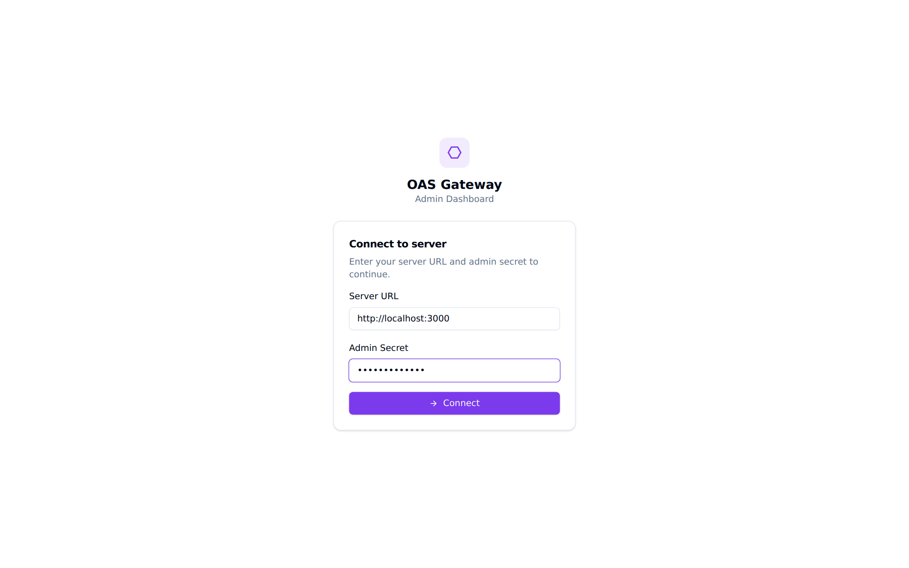 | 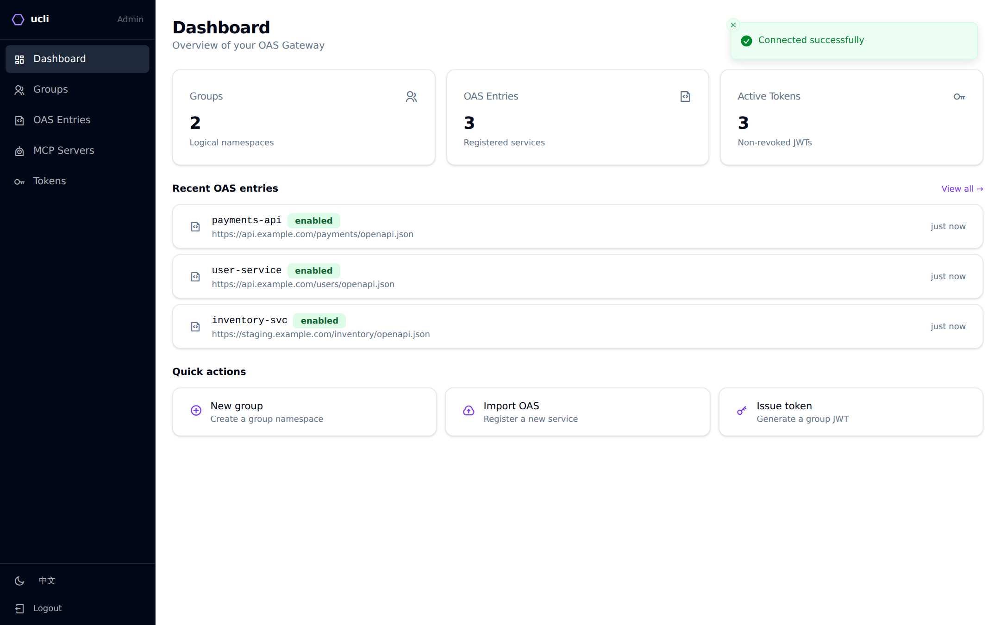 |

### Groups

| Groups list | New Group dialog |
|-------------|-----------------|
| 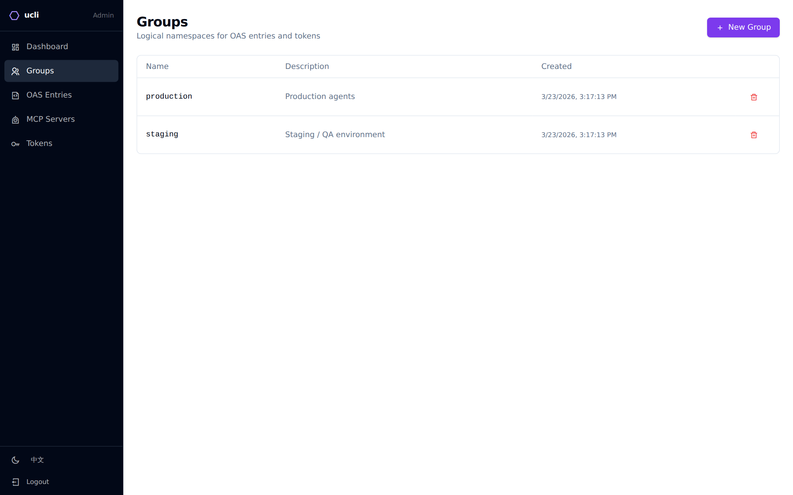 | 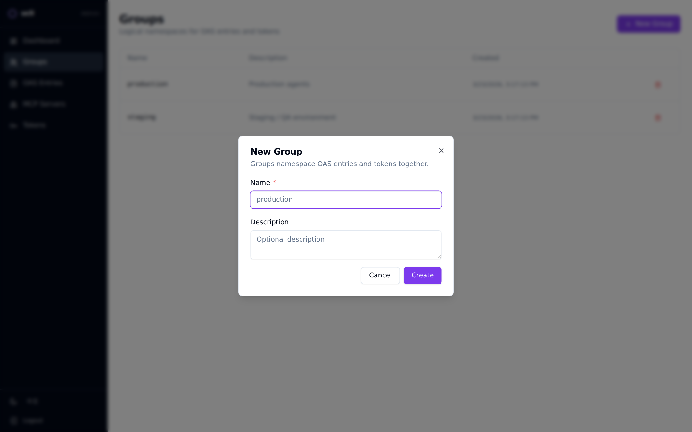 |

### OAS Entries

| OAS list | Edit OAS Entry |
|----------|---------------|
| 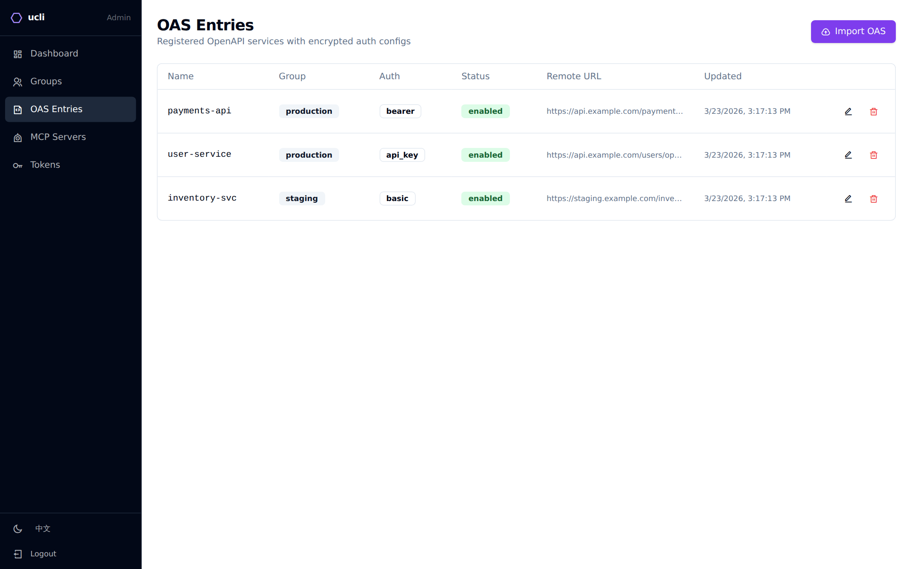 | 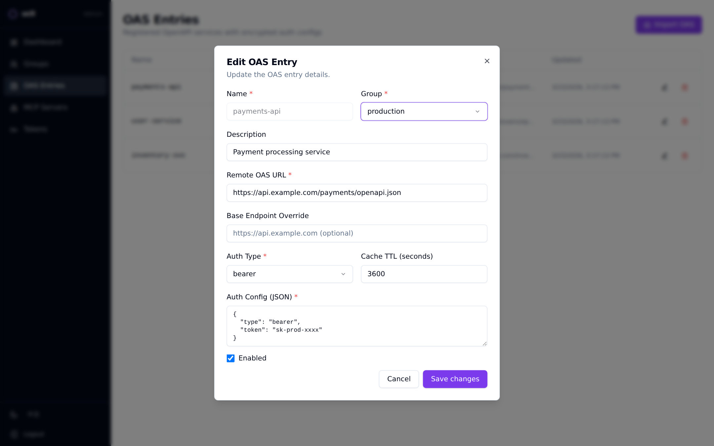 |

### MCP Servers

| MCP list | Add MCP Server |
|----------|---------------|
| 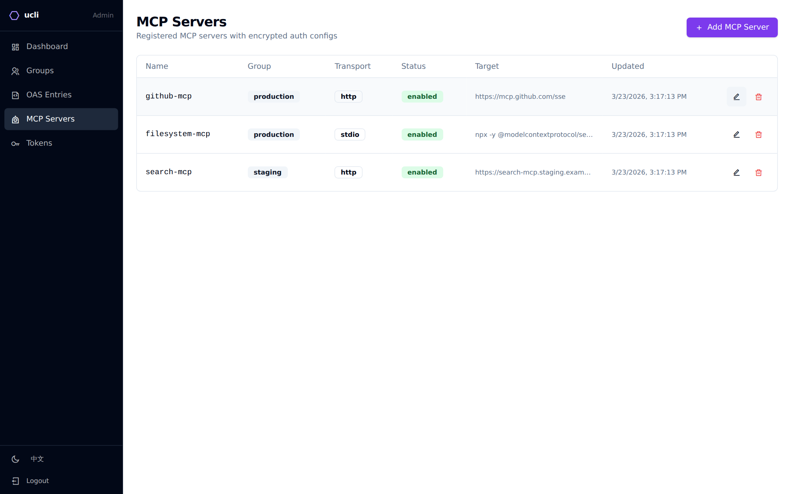 | 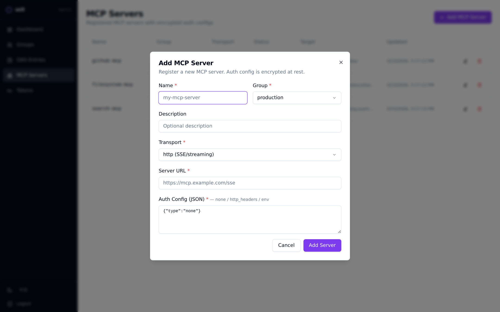 |

### Tokens

| Tokens list | Issue Token |
|-------------|-------------|
| 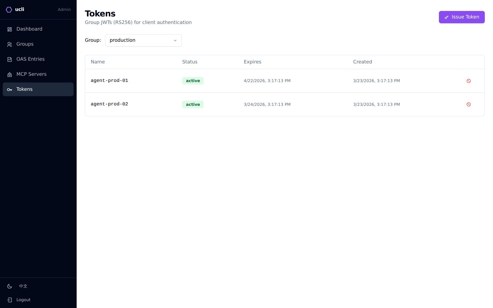 | 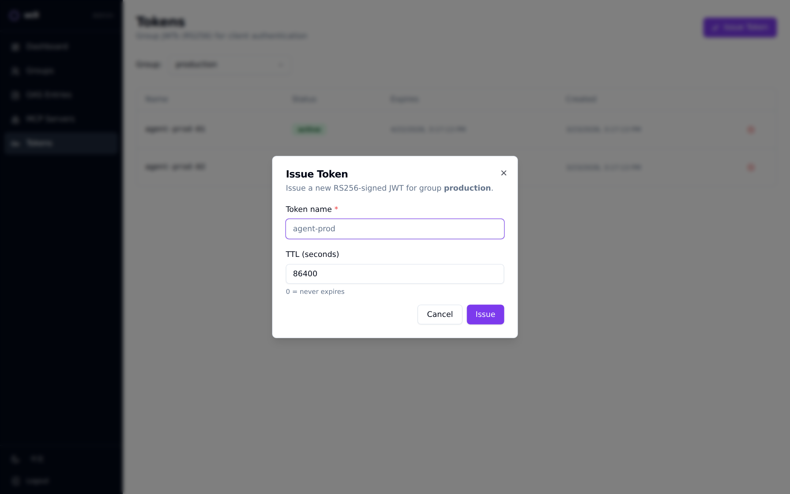 |

### Dark Mode

| Dashboard (Dark) | OAS Entries (Dark) |
|------------------|--------------------|
| 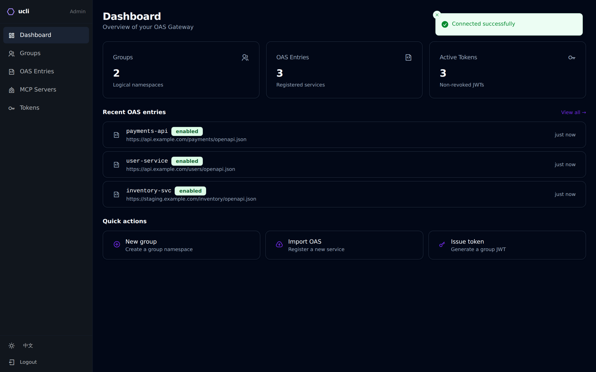 | 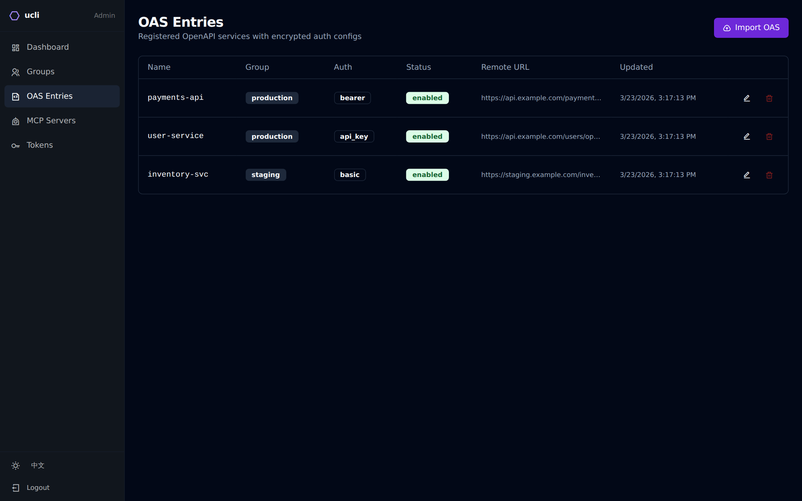 |

### Simplified Chinese (简体中文)

| Dashboard (中文) | MCP Servers (中文) |
|-----------------|-------------------|
| 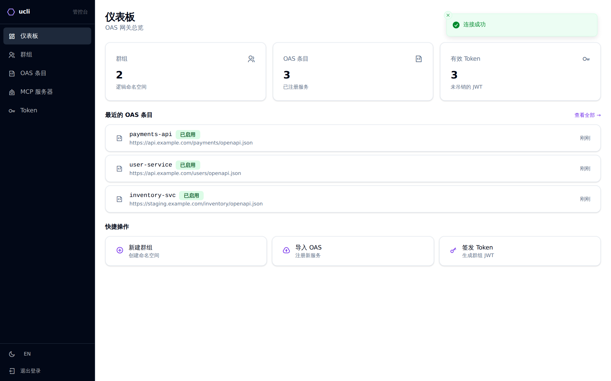 | 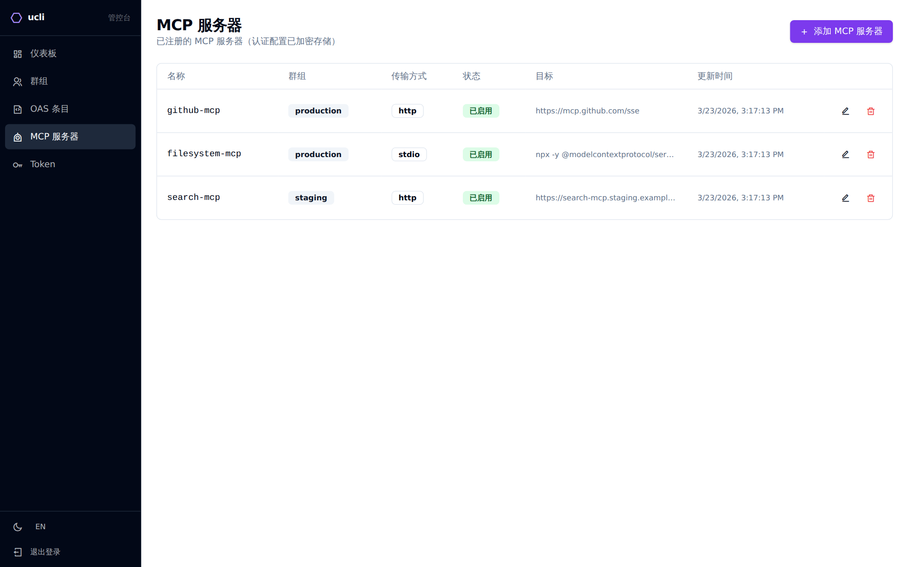 |

---

## Configuration

The UI is built and bundled into the server package. See [`packages/server/README.md`](../server/README.md) for full server configuration and deployment instructions.

### Build locally

```bash
# From repo root
pnpm --filter @tronsfey/ucli-admin build
```

The build output is in `packages/admin/dist/` and is automatically copied into the server package at publish time.
