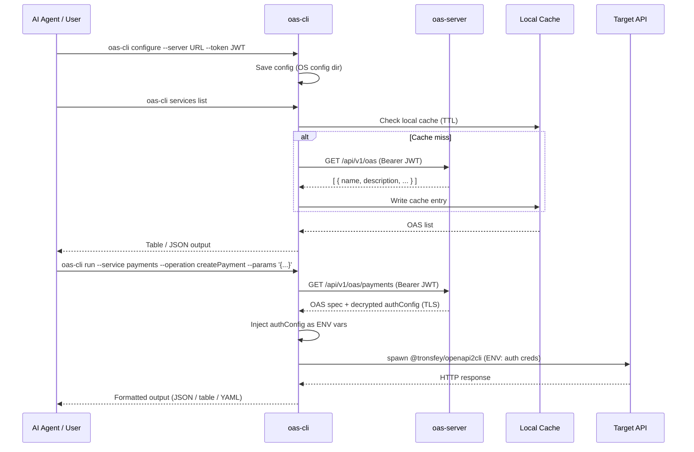

<h1 align="center">OAS Gateway CLI</h1>

<p align="center">
  <a href="https://www.npmjs.com/package/@tronsfey/oas-cli"></a>
  
  
  
</p>

<p align="center">
  English | <a href="./README.zh.md">中文</a>
</p>

---

## Overview

`@tronsfey/oas-cli` is the client component of OAS Gateway. It gives AI agents (and humans) a simple interface to:

- **Discover** OpenAPI services registered on an OAS Gateway server
- **Execute** API operations without ever handling credentials directly
- **Cache** specs locally to reduce round-trips

Auth credentials (bearer tokens, API keys, OAuth2 secrets) are stored encrypted on the server and injected as **environment variables** into the operation subprocess at runtime — they are **never written to disk** or visible in process listings.

## How It Works



## Installation

```bash
npm install -g @tronsfey/oas-cli
# or
pnpm add -g @tronsfey/oas-cli
```

## Quick Start

```bash
# 1. Configure (get server URL and JWT from your admin)
oas-cli configure --server http://localhost:3000 --token <group-jwt>

# 2. List available services
oas-cli services list

# 3. Inspect a service's operations
oas-cli services info payments

# 4. Run an operation
oas-cli run --service payments --operation getPetById --params '{"petId": 42}'
```

## Command Reference

### `configure`

Store the server URL and group JWT locally.

```bash
oas-cli configure --server <url> --token <jwt>
```

| Flag | Required | Description |
|------|----------|-------------|
| `--server` | Yes | OAS Gateway server URL (e.g. `https://gateway.example.com`) |
| `--token` | Yes | Group JWT issued by the server admin |

Config is stored in the OS-appropriate config directory:
- Linux/macOS: `~/.config/oas-cli/`
- Windows: `%APPDATA%\oas-cli\`

---

### `services list`

List all OpenAPI services available to your group.

```bash
oas-cli services list [--format table|json|yaml] [--refresh]
```

| Flag | Default | Description |
|------|---------|-------------|
| `--format` | `table` | Output format: `table`, `json`, or `yaml` |
| `--refresh` | `false` | Bypass local cache and fetch fresh from server |

**Example output (table):**

```
NAME         DESCRIPTION              CACHE TTL
payments     Payments service API     3600s
inventory    Inventory management     1800s
crm          CRM operations           7200s
```

**Example output (json):**

```json
[
  { "name": "payments", "description": "Payments service API", "cacheTtl": 3600 },
  { "name": "inventory", "description": "Inventory management", "cacheTtl": 1800 }
]
```

---

### `services info <name>`

Show detailed information about a specific service, including its available operations.

```bash
oas-cli services info <service-name> [--format table|json|yaml]
```

| Argument/Flag | Description |
|---------------|-------------|
| `<name>` | Service name from `services list` |
| `--format` | Output format (`table` default) |

---

### `run`

Execute a single API operation defined in an OpenAPI spec.

```bash
oas-cli run --service <name> --operation <operationId> [options]
```

| Flag | Required | Description |
|------|----------|-------------|
| `--service` | Yes | Service name (from `services list`) |
| `--operation` | Yes | `operationId` from the OpenAPI spec |
| `--params` | No | JSON string of parameters (path, query, body merged) |
| `--format` | No | Output format: `json` (default), `table`, `yaml` |
| `--query` | No | JMESPath expression to filter the response |

**Examples:**

```bash
# GET with path parameter
oas-cli run --service petstore --operation getPetById \
  --params '{"petId": 42}'

# POST with body
oas-cli run --service payments --operation createPayment \
  --params '{"amount": 100, "currency": "USD", "recipient": "acct_123"}' \
  --format json

# GET with query parameter + JMESPath filter
oas-cli run --service inventory --operation listProducts \
  --params '{"category": "electronics", "limit": 10}' \
  --query 'items[?price < `50`].name'

# POST with data from file
oas-cli run --service crm --operation createContact \
  --params "@./contact.json"
```

---

### `refresh`

Force-refresh the local OAS cache from the server.

```bash
oas-cli refresh [--service <name>]
```

| Flag | Description |
|------|-------------|
| `--service` | Refresh only a specific service (omit to refresh all) |

---

### `help`

Show available commands and AI agent usage instructions.

```bash
oas-cli help
```

## Configuration

Config is managed via the `configure` command. Values are stored in the OS config dir using [conf](https://github.com/sindresorhus/conf).

| Key | Description |
|-----|-------------|
| `serverUrl` | OAS Gateway server URL |
| `token` | Group JWT for authenticating with the server |

## Caching

- OAS entries are cached locally as JSON files in the OS temp dir (`oas-cli/` subdirectory)
- Cache TTL per entry is set by the server admin via the `cacheTtl` field (seconds)
- Expired entries are automatically re-fetched on next access
- Force a refresh: `oas-cli refresh` or use `--refresh` flag on `services list`

## Auth Handling

Credentials are **never exposed** to the agent or written to disk:

1. CLI fetches the OAS entry from the server over TLS (includes decrypted `authConfig`)
2. `authConfig` is passed as **environment variables** to the `@tronsfey/openapi2cli` subprocess
3. The subprocess uses the credentials to call the target API
4. The in-memory `authConfig` is discarded after the subprocess exits

This means credentials never appear in:
- Process listings (`ps aux`)
- Shell history
- Log files
- The agent's context window

## For AI Agents

The recommended workflow for AI agents using `oas-cli` as a skill:

```bash
# Step 1: Discover available services
oas-cli services list --format json

# Step 2: Inspect a service to see available operations
oas-cli services info <service-name> --format json

# Step 3: Execute an operation
oas-cli run --service <name> --operation <operationId> \
  --params '{ ... }' --format json

# Step 4: Filter results with JMESPath
oas-cli run --service inventory --operation listProducts \
  --query 'items[?inStock == `true`] | [0:5]'

# Step 5: Chain operations (use output from one as input to another)
PRODUCT_ID=$(oas-cli run --service inventory --operation listProducts \
  --query 'items[0].id' | tr -d '"')
oas-cli run --service orders --operation createOrder \
  --params "{\"productId\": \"$PRODUCT_ID\", \"quantity\": 1}"
```

**Tips for agents:**
- Always run `services list` first to discover what's available
- Use `--format json` for programmatic parsing
- Use `--query` with JMESPath to extract specific fields
- Check pagination fields (`nextPage`, `totalCount`) for list operations
- If a service seems stale, run `oas-cli refresh --service <name>`

## Error Reference

| Error | Likely Cause | Resolution |
|-------|-------------|------------|
| `Unauthorized (401)` | JWT expired or revoked | Get a new token from the admin |
| `Service not found` | Service name misspelled or not in group | Run `services list` to see available services |
| `Operation not found` | Invalid `operationId` | Run `services info <name>` to see valid operations |
| `Connection refused` | Server not running or wrong URL | Check server URL with `oas-cli configure` |
| `Cache error` | Temp dir permissions issue | Run `oas-cli refresh` to reset cache |
