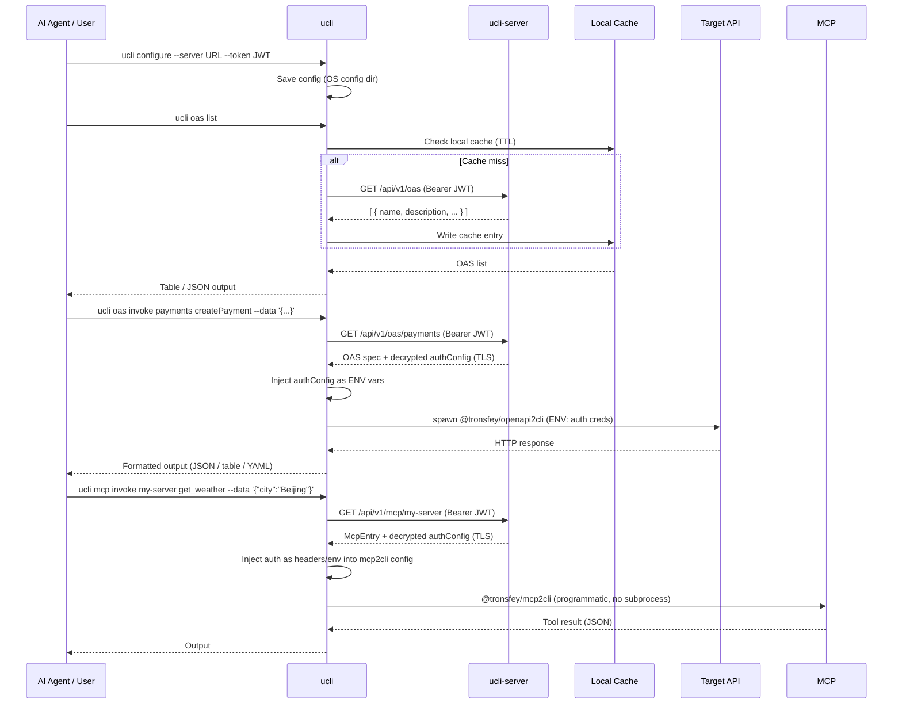

<h1 align="center">ucli</h1>

<p align="center">
  <a href="https://www.npmjs.com/package/@tronsfey/ucli"></a>
  
  
  
</p>

<p align="center">
  English | <a href="./README.zh.md">中文</a>
</p>

---

## Overview

`@tronsfey/ucli` is the client component of ucli. It gives AI agents (and humans) a simple interface to:

- **Discover** OpenAPI services registered on a ucli server
- **Execute** API operations without ever handling credentials directly
- **Cache** specs locally to reduce round-trips
- **Invoke** MCP server tools via `ucli mcp invoke <server> <tool>`

Auth credentials (bearer tokens, API keys, OAuth2 secrets, MCP headers/env) are stored encrypted on the server and injected at runtime — they are **never written to disk** or visible in process listings.

## How It Works



## Installation

```bash
npm install -g @tronsfey/ucli
# or
pnpm add -g @tronsfey/ucli
```

## Quick Start

```bash
# 1. Configure (get server URL and JWT from your admin)
ucli configure --server http://localhost:3000 --token <group-jwt>

# 2. List available services
ucli oas list

# 3. Inspect a service's operations
ucli oas operations payments

# 4. Run an operation
ucli oas invoke payments getPetById --params '{"petId": 42}'
```

## Command Reference

### Global Flags

| Flag | Default | Description |
|------|---------|-------------|
| `--debug` | `false` | Enable verbose debug logging |
| `--output <mode>` | `text` | Output mode: `text` or `json` (json wraps all results in a structured envelope) |

---

### `configure`

Store the server URL and group JWT locally.

```bash
ucli configure --server <url> --token <jwt>
```

| Flag | Required | Description |
|------|----------|-------------|
| `--server` | Yes | ucli server URL (e.g. `https://gateway.example.com`) |
| `--token` | Yes | Group JWT issued by the server admin |

Config is stored in the OS-appropriate config directory:
- Linux/macOS: `~/.config/ucli/`
- Windows: `%APPDATA%\ucli\`

---

### `oas list`

List all OpenAPI services available to your group.

```bash
ucli oas list [--format table|json|yaml] [--refresh]
```

| Flag | Default | Description |
|------|---------|-------------|
| `--format` | `table` | Output format: `table`, `json`, or `yaml` |
| `--refresh` | `false` | Bypass local cache and fetch fresh from server |

**Example output (table):**

```
SERVICE      AUTH      DESCRIPTION
----------   --------  ------------------------------------------
payments     bearer    Payments service API
inventory    api_key   Inventory management
crm          oauth2_cc CRM operations
```

---

### `oas describe <service>`

Show detailed information about a specific service.

```bash
ucli oas describe <service> [--format json|table|yaml]
```

| Argument/Flag | Description |
|---------------|-------------|
| `<service>` | Service name from `oas list` |
| `--format` | Output format (`json` default) |

---

### `oas operations <service>`

List all available API operations for a service.

```bash
ucli oas operations <service> [--format json|table|yaml]
```

| Argument/Flag | Description |
|---------------|-------------|
| `<service>` | Service name from `oas list` |
| `--format` | Output format (`json` default) |

---

### `oas operation <service> <api>`

Show detailed input/output parameters for a specific API operation.

```bash
ucli oas operation <service> <api>
```

| Argument | Description |
|----------|-------------|
| `<service>` | Service name from `oas list` |
| `<api>` | Operation ID from `oas operations <service>` |

---

### `oas invoke <service> <api>`

Execute a single API operation defined in an OpenAPI spec.

```bash
ucli oas invoke <service> <api> [options]
```

| Flag | Required | Description |
|------|----------|-------------|
| `--data` | No | Request body (JSON string or @filename) |
| `--params` | No | JSON string of parameters (path, query merged) |
| `--format` | No | Output format: `json` (default), `table`, `yaml` |
| `--query` | No | JMESPath expression to filter the response |
| `--machine` | No | Structured JSON envelope output (agent-friendly) |
| `--dry-run` | No | Preview the HTTP request without executing (implies `--machine`) |

**Examples:**

```bash
# GET with path parameter
ucli oas invoke petstore getPetById --params '{"petId": 42}'

# POST with body
ucli oas invoke payments createPayment \
  --data '{"amount": 100, "currency": "USD", "recipient": "acct_123"}'

# GET with query parameter + JMESPath filter
ucli oas invoke inventory listProducts \
  --params '{"category": "electronics", "limit": 10}' \
  --query 'items[?price < `50`].name'

# Agent-friendly structured output
ucli oas invoke payments listTransactions --machine

# Preview request without executing
ucli oas invoke payments createPayment --dry-run \
  --data '{"amount": 5000, "currency": "USD"}'
```

---

### `mcp list`

List all MCP servers available to your group.

```bash
ucli mcp list [--format table|json|yaml]
```

| Flag | Default | Description |
|------|---------|-------------|
| `--format` | `table` | Output format: `table`, `json`, or `yaml` |

---

### `mcp tools <server>`

List tools available on a specific MCP server.

```bash
ucli mcp tools <server> [--format table|json|yaml]
```

| Argument/Flag | Description |
|---------------|-------------|
| `<server>` | MCP server name from `mcp list` |
| `--format` | Output format (`table` default) |

---

### `mcp tool <server> <tool>`

Show detailed parameter schema for a tool on a MCP server.

```bash
ucli mcp tool <server> <tool> [--json]
```

| Argument/Flag | Description |
|---------------|-------------|
| `<server>` | MCP server name from `mcp list` |
| `<tool>` | Tool name from `mcp tools <server>` |
| `--json` | Output full schema as JSON (for agent consumption) |

**Examples:**

```bash
# Human-readable tool description
ucli mcp tool weather get_forecast

# JSON schema (for agent introspection)
ucli mcp tool weather get_forecast --json
```

---

### `mcp invoke <server> <tool>`

Execute a tool on an MCP server.

```bash
ucli mcp invoke <server> <tool> [--data <json>] [--json]
```

| Flag | Description |
|------|-------------|
| `--data` | Tool arguments as a JSON object |
| `--json` | Machine-readable JSON output |

**Examples:**

```bash
# Call a weather tool with JSON input
ucli mcp invoke weather get_forecast --data '{"location": "New York", "units": "metric"}'

# Call a search tool
ucli mcp invoke search-server web_search --data '{"query": "ucli MCP", "limit": 5}'

# Get structured JSON output
ucli mcp invoke weather get_forecast --json --data '{"location": "New York"}'
```

---

### `introspect`

Return a complete capability manifest for AI agent discovery in one call.

```bash
ucli introspect [--format json|yaml]
```

| Flag | Default | Description |
|------|---------|-------------|
| `--format` | `json` | Output format: `json` or `yaml` |

---

### `refresh`

Force-refresh the local OAS cache from the server.

```bash
ucli refresh [--service <name>]
```

| Flag | Description |
|------|-------------|
| `--service` | Refresh only a specific service (omit to refresh all) |

---

### `doctor`

Check configuration, server connectivity, and token validity.

```bash
ucli doctor
```

---

### `completions <shell>`

Generate a shell completion script.

```bash
ucli completions bash
ucli completions zsh
ucli completions fish
```

---

### `help`

Show available commands and AI agent usage instructions.

```bash
ucli help
```

## Configuration

Config is managed via the `configure` command. Values are stored in the OS config dir using [conf](https://github.com/sindresorhus/conf).

| Key | Description |
|-----|-------------|
| `serverUrl` | ucli server URL |
| `token` | Group JWT for authenticating with the server |

## Caching

- OAS entries are cached locally as JSON files in the OS temp dir (`ucli/` subdirectory)
- Cache TTL per entry is set by the server admin via the `cacheTtl` field (seconds)
- Expired entries are automatically re-fetched on next access
- Force a refresh: `ucli refresh` or use `--refresh` flag on `oas list`

## Auth Handling

Credentials are **never exposed** to the agent or written to disk:

1. CLI fetches the OAS entry from the server over TLS (includes decrypted `authConfig`)
2. `authConfig` is passed as **environment variables** to the `@tronsfey/openapi2cli` subprocess
3. The subprocess uses the credentials to call the target API
4. The in-memory `authConfig` is discarded after the subprocess exits

This means credentials never appear in:
- Process listings (`ps aux`)
- Shell history
- Log files
- The agent's context window

For MCP servers, auth (`http_headers` or `env`) is injected directly into the `@tronsfey/mcp2cli` programmatic config — it is **never passed as CLI arguments** (which would be visible in `ps`).

## For AI Agents

The recommended workflow for AI agents using `ucli` as a skill:

```bash
# Step 1: Discover all capabilities in one call (recommended first action)
ucli introspect --format json

# Step 2: List available services
ucli oas list --format json

# Step 3: Inspect a service to see available operations
ucli oas operations <service-name> --format json

# Step 4: Get detailed info about a specific API operation
ucli oas operation <service-name> <api>

# Step 5: Preview a request (dry-run — no execution)
ucli oas invoke <service-name> <api> --dry-run \
  --data '{ ... }'

# Step 6: Execute an operation with structured output
ucli oas invoke <service-name> <api> \
  --data '{ ... }' --machine

# Step 7: Filter results with JMESPath
ucli oas invoke inventory listProducts \
  --query 'items[?inStock == `true`] | [0:5]'

# Step 8: Chain operations (use output from one as input to another)
PRODUCT_ID=$(ucli oas invoke inventory listProducts \
  --query 'items[0].id' | tr -d '"')
ucli oas invoke orders createOrder \
  --data "{\"productId\": \"$PRODUCT_ID\", \"quantity\": 1}"

# Step 9: MCP — inspect a tool, then call it with JSON input
ucli mcp tool weather get_forecast --json
ucli mcp invoke weather get_forecast --data '{"location": "New York", "units": "metric"}'
```

**Tips for agents:**
- Run `ucli introspect` first to get a full capability manifest in one call
- Use `ucli oas list` to discover available OAS services
- Use `ucli mcp list` to discover available MCP servers
- Use `--machine` for structured envelope output from API operations
- Use `--dry-run` to preview requests before executing destructive operations
- Use `ucli mcp tool <server> <tool> --json` to discover tool parameters
- Use `--data` for both MCP tool calls and OAS API calls (JSON input)
- Use `--format json` for programmatic parsing
- Use `--query` with JMESPath to extract specific fields
- Check pagination fields (`nextPage`, `totalCount`) for list operations
- If a service seems stale, run `ucli refresh --service <name>`

## Error Reference

| Error | Likely Cause | Resolution |
|-------|-------------|------------|
| `Unauthorized (401)` | JWT expired or revoked | Get a new token from the admin |
| `Service not found` | Service name misspelled or not in group | Run `ucli oas list` to see available services |
| `Operation not found` | Invalid `operationId` | Run `ucli oas operations <service>` to see valid operations |
| `MCP server not found` | Server name misspelled or not in group | Run `ucli mcp list` to see available servers |
| `Tool not found` | Invalid tool name | Run `ucli mcp tools <server>` to see available tools |
| `Connection refused` | Server not running or wrong URL | Check server URL with `ucli doctor` |
| `Cache error` | Temp dir permissions issue | Run `ucli refresh` to reset cache |
