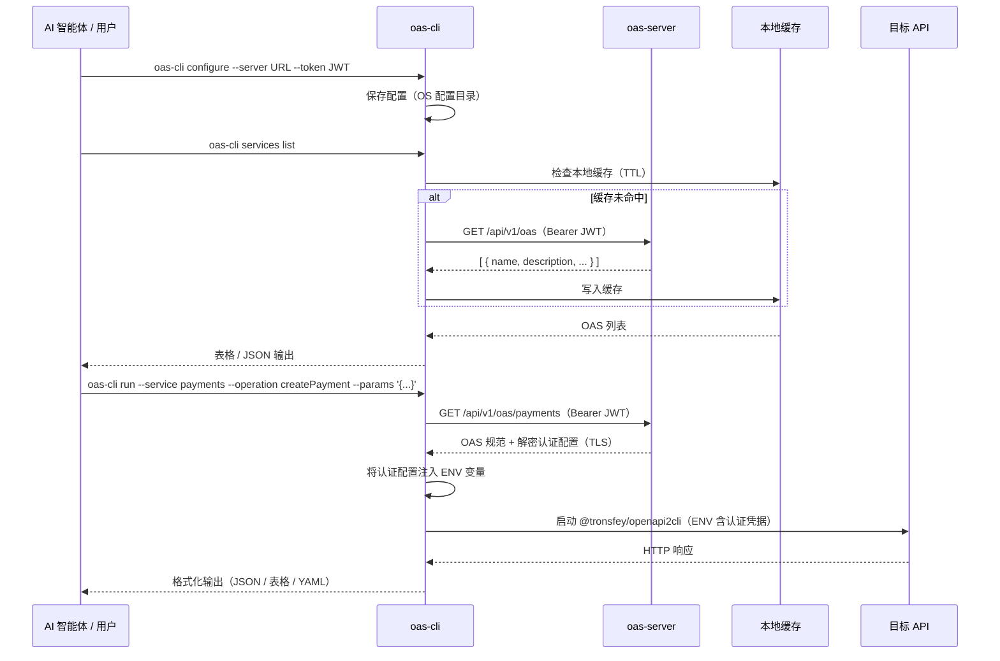

<p align="center">
  
</p>

<p align="center">
  <a href="https://www.npmjs.com/package/@tronsfey/oas-cli"></a>
  
  
  
</p>

<p align="center">
  <a href="./README.md">English</a> | 中文
</p>

---

## 概述

`@tronsfey/oas-cli` 是 OAS Gateway 的客户端组件，为 AI 智能体（和人类）提供简洁的接口来：

- **发现** 注册在 OAS Gateway 服务端上的 OpenAPI 服务
- **执行** API 操作，无需直接处理凭据
- **本地缓存** 规范，减少网络请求

认证凭据（Bearer Token、API 密钥、OAuth2 密钥）在服务端加密存储，运行时以**环境变量**方式注入操作子进程——**永不落盘**，也不会出现在进程列表中。

## 工作原理



## 安装

```bash
npm install -g @tronsfey/oas-cli
# 或
pnpm add -g @tronsfey/oas-cli
```

## 快速开始

```bash
# 1. 配置（从管理员获取服务器 URL 和 JWT）
oas-cli configure --server http://localhost:3000 --token <group-jwt>

# 2. 列出可用服务
oas-cli services list

# 3. 查看服务的操作列表
oas-cli services info payments

# 4. 执行操作
oas-cli run --service payments --operation getPetById --params '{"petId": 42}'
```

## 命令参考

### `configure`

将服务器 URL 和群组 JWT 保存到本地。

```bash
oas-cli configure --server <url> --token <jwt>
```

| 参数 | 必填 | 说明 |
|------|------|------|
| `--server` | 是 | OAS Gateway 服务器 URL（如 `https://gateway.example.com`） |
| `--token` | 是 | 服务端管理员签发的群组 JWT |

配置存储在 OS 对应的配置目录：
- Linux/macOS：`~/.config/oas-cli/`
- Windows：`%APPDATA%\oas-cli\`

---

### `services list`

列出当前群组可访问的所有 OpenAPI 服务。

```bash
oas-cli services list [--format table|json|yaml] [--refresh]
```

| 参数 | 默认值 | 说明 |
|------|--------|------|
| `--format` | `table` | 输出格式：`table`、`json` 或 `yaml` |
| `--refresh` | `false` | 绕过本地缓存，从服务器重新拉取 |

**示例输出（table）：**

```
NAME         DESCRIPTION              CACHE TTL
payments     支付服务 API              3600s
inventory    库存管理                  1800s
crm          CRM 操作                  7200s
```

**示例输出（json）：**

```json
[
  { "name": "payments", "description": "支付服务 API", "cacheTtl": 3600 },
  { "name": "inventory", "description": "库存管理", "cacheTtl": 1800 }
]
```

---

### `services info <name>`

显示指定服务的详细信息（包括可用操作列表）。

```bash
oas-cli services info <service-name> [--format table|json|yaml]
```

| 参数 | 说明 |
|------|------|
| `<name>` | 服务名称（来自 `services list`） |
| `--format` | 输出格式（默认 `table`） |

---

### `run`

执行 OpenAPI 规范中定义的单个 API 操作。

```bash
oas-cli run --service <name> --operation <operationId> [选项]
```

| 参数 | 必填 | 说明 |
|------|------|------|
| `--service` | 是 | 服务名称（来自 `services list`） |
| `--operation` | 是 | OpenAPI 规范中的 `operationId` |
| `--params` | 否 | JSON 字符串（路径参数、查询参数、请求体合并传入） |
| `--format` | 否 | 输出格式：`json`（默认）、`table`、`yaml` |
| `--query` | 否 | JMESPath 表达式，用于过滤响应 |

**示例：**

```bash
# GET 带路径参数
oas-cli run --service petstore --operation getPetById \
  --params '{"petId": 42}'

# POST 带请求体
oas-cli run --service payments --operation createPayment \
  --params '{"amount": 100, "currency": "CNY", "recipient": "acct_123"}' \
  --format json

# 使用 JMESPath 过滤结果
oas-cli run --service inventory --operation listProducts \
  --params '{"category": "electronics"}' \
  --query 'items[?price < `500`].name'

# 从文件读取参数
oas-cli run --service crm --operation createContact \
  --params "@./contact.json"
```

---

### `refresh`

强制从服务器刷新本地 OAS 缓存。

```bash
oas-cli refresh [--service <name>]
```

| 参数 | 说明 |
|------|------|
| `--service` | 仅刷新指定服务（不填则刷新所有） |

---

### `help`

显示命令列表及 AI 智能体使用说明。

```bash
oas-cli help
```

## 配置说明

配置通过 `configure` 命令管理，使用 [conf](https://github.com/sindresorhus/conf) 存储到 OS 配置目录。

| 键名 | 说明 |
|------|------|
| `serverUrl` | OAS Gateway 服务器 URL |
| `token` | 用于与服务端认证的群组 JWT |

## 缓存机制

- OAS 条目以 JSON 文件形式缓存到 OS 临时目录（`oas-cli/` 子目录）
- 每个条目的缓存 TTL 由服务端管理员通过 `cacheTtl` 字段设置（单位：秒）
- 过期条目在下次访问时自动重新拉取
- 强制刷新：`oas-cli refresh` 或在 `services list` 时添加 `--refresh`

## 认证处理

凭据**永不暴露**给智能体，也不会落盘：

1. CLI 通过 TLS 从服务器获取 OAS 条目（含解密后的 `authConfig`）
2. `authConfig` 以**环境变量**方式传递给 `@tronsfey/openapi2cli` 子进程
3. 子进程使用凭据调用目标 API
4. 子进程退出后，内存中的 `authConfig` 被丢弃

凭据不会出现在：
- 进程列表（`ps aux`）
- Shell 历史记录
- 日志文件
- 智能体的上下文窗口

## AI 智能体使用指南

AI 智能体将 `oas-cli` 作为技能使用时，推荐的工作流程：

```bash
# 第一步：发现可用服务
oas-cli services list --format json

# 第二步：查看服务支持的操作
oas-cli services info <service-name> --format json

# 第三步：执行操作
oas-cli run --service <name> --operation <operationId> \
  --params '{ ... }' --format json

# 第四步：用 JMESPath 过滤结果
oas-cli run --service inventory --operation listProducts \
  --query 'items[?inStock == `true`] | [0:5]'

# 第五步：链式操作（将前一个结果作为下一个的输入）
PRODUCT_ID=$(oas-cli run --service inventory --operation listProducts \
  --query 'items[0].id' | tr -d '"')
oas-cli run --service orders --operation createOrder \
  --params "{\"productId\": \"$PRODUCT_ID\", \"quantity\": 1}"
```

**智能体使用建议：**
- 始终先运行 `services list` 发现可用服务
- 使用 `--format json` 方便程序解析
- 使用 `--query` 配合 JMESPath 提取特定字段
- 注意列表操作的分页字段（`nextPage`、`totalCount`）
- 若服务数据疑似过期，执行 `oas-cli refresh --service <name>`

## 错误参考

| 错误 | 可能原因 | 解决方法 |
|------|---------|---------|
| `Unauthorized (401)` | JWT 已过期或被吊销 | 联系管理员获取新令牌 |
| `Service not found` | 服务名拼写错误或不在当前群组 | 运行 `services list` 查看可用服务 |
| `Operation not found` | 无效的 `operationId` | 运行 `services info <name>` 查看有效操作 |
| `Connection refused` | 服务器未运行或 URL 错误 | 用 `oas-cli configure` 检查服务器 URL |
| `Cache error` | 临时目录权限问题 | 运行 `oas-cli refresh` 重置缓存 |
