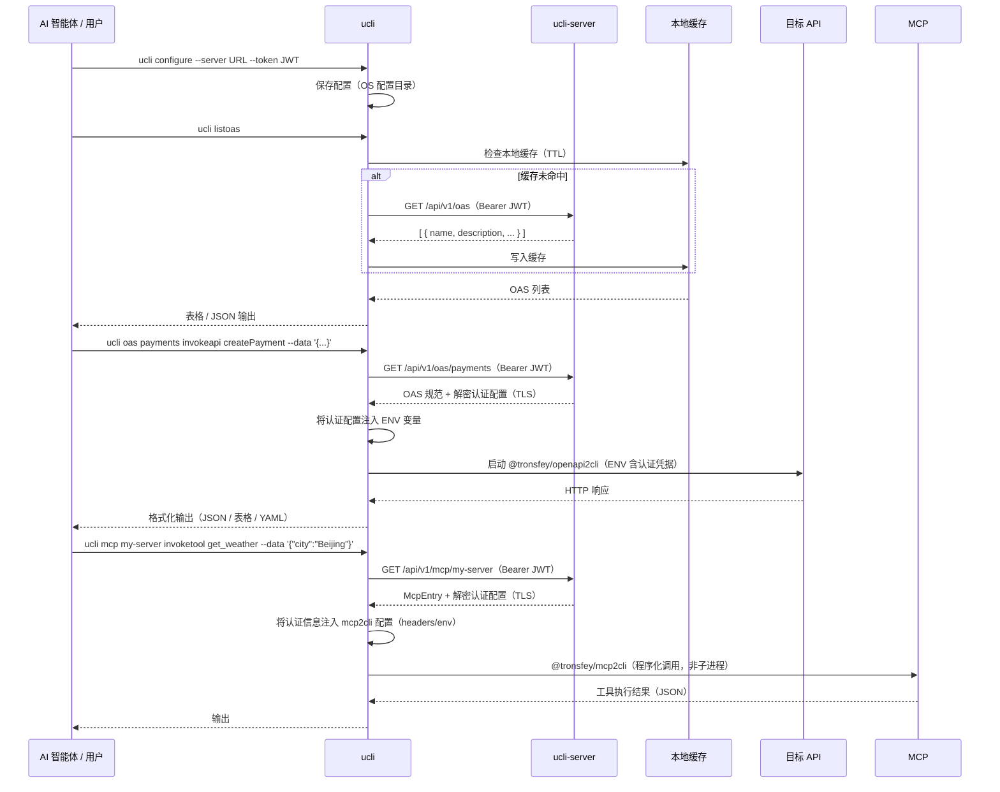

<h1 align="center">ucli</h1>

<p align="center">
  <a href="https://www.npmjs.com/package/@tronsfey/ucli"></a>
  
  
  
</p>

<p align="center">
  <a href="./README.md">English</a> | 中文
</p>

---

## 概述

`@tronsfey/ucli` 是 ucli 的客户端组件，为 AI 智能体（和人类）提供简洁的接口来：

- **发现** 注册在 ucli 服务端上的 OpenAPI 服务
- **执行** API 操作，无需直接处理凭据
- **本地缓存** 规范，减少网络请求
- **调用** MCP 服务器工具，使用 `ucli mcp <server> invoketool <tool>`

认证凭据（Bearer Token、API 密钥、OAuth2 密钥、MCP 请求头/环境变量）在服务端加密存储，运行时以环境变量或请求头方式注入——**永不落盘**，也不会出现在进程列表中。

## 工作原理



## 安装

```bash
npm install -g @tronsfey/ucli
# 或
pnpm add -g @tronsfey/ucli
```

## 快速开始

```bash
# 1. 配置（从管理员获取服务器 URL 和 JWT）
ucli configure --server http://localhost:3000 --token <group-jwt>

# 2. 列出可用服务
ucli listoas

# 3. 查看服务的操作列表
ucli oas payments listapi

# 4. 执行操作
ucli oas payments invokeapi getPetById --params '{"petId": 42}'
```

## 命令参考

### `configure`

将服务器 URL 和群组 JWT 保存到本地。

```bash
ucli configure --server <url> --token <jwt>
```

| 参数 | 必填 | 说明 |
|------|------|------|
| `--server` | 是 | ucli 服务器 URL（如 `https://gateway.example.com`） |
| `--token` | 是 | 服务端管理员签发的群组 JWT |

配置存储在 OS 对应的配置目录：
- Linux/macOS：`~/.config/ucli/`
- Windows：`%APPDATA%\ucli\`

---

### `listoas`

列出当前群组可访问的所有 OpenAPI 服务。

```bash
ucli listoas [--format table|json|yaml] [--refresh]
```

| 参数 | 默认值 | 说明 |
|------|--------|------|
| `--format` | `table` | 输出格式：`table`、`json` 或 `yaml` |
| `--refresh` | `false` | 绕过本地缓存，从服务器重新拉取 |

---

### `oas <service> info`

显示指定服务的详细信息。

```bash
ucli oas <service> info [--format json|table|yaml]
```

---

### `oas <service> listapi`

列出指定服务的所有可用 API 操作。

```bash
ucli oas <service> listapi [--format json|table|yaml]
```

---

### `oas <service> apiinfo <api>`

显示指定 API 操作的详细输入输出参数信息。

```bash
ucli oas <service> apiinfo <api>
```

---

### `oas <service> invokeapi <api>`

执行 OpenAPI 规范中定义的单个 API 操作。

```bash
ucli oas <service> invokeapi <api> [选项]
```

| 参数 | 必填 | 说明 |
|------|------|------|
| `--data` | 否 | 请求体（JSON 字符串或 @文件名） |
| `--params` | 否 | JSON 字符串（路径参数、查询参数合并传入） |
| `--format` | 否 | 输出格式：`json`（默认）、`table`、`yaml` |
| `--query` | 否 | JMESPath 表达式，用于过滤响应 |
| `--machine` | 否 | 结构化 JSON 信封输出（Agent 友好模式） |
| `--dry-run` | 否 | 预览 HTTP 请求但不执行（隐含 `--machine`） |

**示例：**

```bash
# GET 带路径参数
ucli oas petstore invokeapi getPetById --params '{"petId": 42}'

# POST 带请求体
ucli oas payments invokeapi createPayment \
  --data '{"amount": 100, "currency": "CNY", "recipient": "acct_123"}'

# 使用 JMESPath 过滤结果
ucli oas inventory invokeapi listProducts \
  --params '{"category": "electronics"}' \
  --query 'items[?price < `500`].name'

# Agent 友好结构化输出
ucli oas payments invokeapi listTransactions --machine

# 预览请求但不执行
ucli oas payments invokeapi createPayment --dry-run \
  --data '{"amount": 5000, "currency": "CNY"}'
```

---

### `listmcp`

列出当前群组可访问的所有 MCP 服务器。

```bash
ucli listmcp [--format table|json|yaml]
```

---

### `mcp <server> listtool`

列出指定 MCP 服务器上的可用工具。

```bash
ucli mcp <server> listtool [--format table|json|yaml]
```

---

### `mcp <server> toolinfo <tool>`

查看 MCP 服务器上指定工具的详细参数模式。

```bash
ucli mcp <server> toolinfo <tool> [--json]
```

| 参数 | 说明 |
|------|------|
| `<server>` | MCP 服务器名称（来自 `listmcp`） |
| `<tool>` | 工具名称（来自 `mcp <server> listtool`） |
| `--json` | 以 JSON 格式输出完整模式（适合 Agent 消费） |

**示例：**

```bash
# 人类可读的工具描述
ucli mcp weather toolinfo get_forecast

# JSON 模式（适合 Agent 内省）
ucli mcp weather toolinfo get_forecast --json
```

---

### `mcp <server> invoketool <tool>`

在 MCP 服务器上执行指定工具。

```bash
ucli mcp <server> invoketool <tool> [--data <json>] [--json]
```

| 参数 | 说明 |
|------|------|
| `--data` | 以 JSON 对象形式传入工具参数 |
| `--json` | 结构化 JSON 输出 |

**示例：**

```bash
# 调用天气工具
ucli mcp weather invoketool get_forecast --data '{"location": "北京", "units": "metric"}'

# 调用搜索工具
ucli mcp search-server invoketool web_search --data '{"query": "ucli MCP", "limit": 5}'

# 获取结构化 JSON 输出
ucli mcp weather invoketool get_forecast --json --data '{"location": "北京"}'
```

---

### `refresh`

强制从服务器刷新本地 OAS 缓存。

```bash
ucli refresh [--service <name>]
```

| 参数 | 说明 |
|------|------|
| `--service` | 仅刷新指定服务（不填则刷新所有） |

---

### `help`

显示命令列表及 AI 智能体使用说明。

```bash
ucli help
```

## 配置说明

配置通过 `configure` 命令管理，使用 [conf](https://github.com/sindresorhus/conf) 存储到 OS 配置目录。

| 键名 | 说明 |
|------|------|
| `serverUrl` | ucli 服务器 URL |
| `token` | 用于与服务端认证的群组 JWT |

## 缓存机制

- OAS 条目以 JSON 文件形式缓存到 OS 临时目录（`ucli/` 子目录）
- 每个条目的缓存 TTL 由服务端管理员通过 `cacheTtl` 字段设置（单位：秒）
- 过期条目在下次访问时自动重新拉取
- 强制刷新：`ucli refresh` 或在 `listoas` 时添加 `--refresh`

## 认证处理

凭据**永不暴露**给智能体，也不会落盘：

1. CLI 通过 TLS 从服务器获取 OAS 条目（含解密后的 `authConfig`）
2. `authConfig` 以**环境变量**方式传递给 `@tronsfey/openapi2cli` 子进程
3. 子进程使用凭据调用目标 API
4. 子进程退出后，内存中的 `authConfig` 被丢弃

凭据不会出现在：
- 进程列表（`ps aux`）
- Shell 历史记录
- 日志文件
- 智能体的上下文窗口

对于 MCP 服务器，认证信息（`http_headers` 或 `env`）直接注入 `@tronsfey/mcp2cli` 的程序化配置中——**永不作为 CLI 参数传递**（否则会出现在 `ps` 列表中）。

## AI 智能体使用指南

AI 智能体将 `ucli` 作为技能使用时，推荐的工作流程：

```bash
# 第一步：发现可用服务
ucli listoas --format json

# 第二步：查看服务支持的操作
ucli oas <service-name> listapi --format json

# 第三步：查看具体 API 的详细参数
ucli oas <service-name> apiinfo <api>

# 第四步：预览请求（dry-run，不执行）
ucli oas <service-name> invokeapi <api> --dry-run \
  --data '{ ... }'

# 第五步：执行操作并获取结构化输出
ucli oas <service-name> invokeapi <api> \
  --data '{ ... }' --machine

# 第六步：用 JMESPath 过滤结果
ucli oas inventory invokeapi listProducts \
  --query 'items[?inStock == `true`] | [0:5]'

# 第七步：链式操作（将前一个结果作为下一个的输入）
PRODUCT_ID=$(ucli oas inventory invokeapi listProducts \
  --query 'items[0].id' | tr -d '"')
ucli oas orders invokeapi createOrder \
  --data "{\"productId\": \"$PRODUCT_ID\", \"quantity\": 1}"

# 第八步：MCP — 查看工具参数模式，然后以 JSON 输入调用
ucli mcp weather toolinfo get_forecast --json
ucli mcp weather invoketool get_forecast --data '{"location": "北京", "units": "metric"}'
```

**智能体使用建议：**
- 始终先运行 `ucli listoas` 发现可用服务
- 使用 `--machine` 获取结构化信封输出
- 使用 `--dry-run` 预览请求，避免误操作
- 使用 `ucli mcp <server> toolinfo <tool> --json` 发现工具参数模式
- 使用 `--data` 传入 JSON 输入（适合复杂或嵌套参数）
- 使用 `--format json` 方便程序解析
- 使用 `--query` 配合 JMESPath 提取特定字段
- 注意列表操作的分页字段（`nextPage`、`totalCount`）
- 若服务数据疑似过期，执行 `ucli refresh --service <name>`

## 错误参考

| 错误 | 可能原因 | 解决方法 |
|------|---------|---------|
| `Unauthorized (401)` | JWT 已过期或被吊销 | 联系管理员获取新令牌 |
| `Service not found` | 服务名拼写错误或不在当前群组 | 运行 `ucli listoas` 查看可用服务 |
| `Operation not found` | 无效的 `operationId` | 运行 `ucli oas <service> listapi` 查看有效操作 |
| `MCP server not found` | MCP 服务器名拼写错误或不在当前群组 | 运行 `ucli listmcp` 查看可用服务器 |
| `Tool not found` | 无效的工具名 | 运行 `ucli mcp <server> listtool` 查看可用工具 |
| `Connection refused` | 服务器未运行或 URL 错误 | 用 `ucli configure` 检查服务器 URL |
| `Cache error` | 临时目录权限问题 | 运行 `ucli refresh` 重置缓存 |
