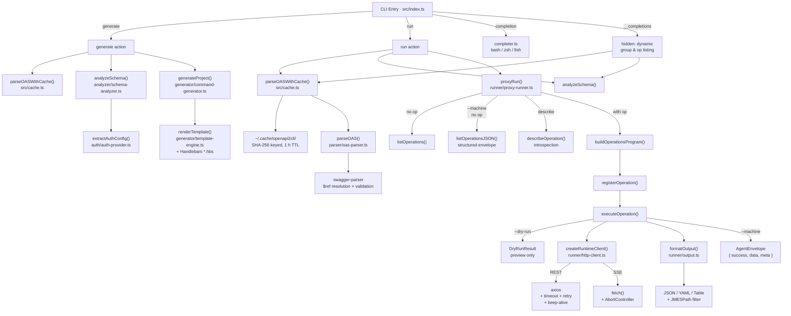

English | [中文](./README.zh.md)

# openapi2cli

Two modes in one tool:

1. **Generate** — scaffold a fully typed Commander.js CLI project from an OpenAPI 3.x spec
2. **Run** — proxy an OpenAPI spec directly from the command line, no code generation needed

## Architecture



## Features

- Parse OAS 3.x specs from a **file path or URL** (full `$ref` resolution)
- Group operations by **tag** → Commander subcommand groups; untagged operations become top-level commands
- Generate **TypeScript source** with correct types, required/optional flags, enum `.choices()` validation
- **5 auth schemes** auto-detected from OAS security definitions (generate mode) or via CLI flags (run mode)
- **SSE streaming** via `eventsource-parser` — full SSE spec support, `[DONE]` sentinel handling
- **Pagination** via `--all-pages` (follows `Link: rel="next"` response headers)
- **JMESPath filtering** via `--query` on every command
- **CJK command names** — Chinese/Japanese/Korean operationIds auto-converted to pinyin
- **OpenAPI extensions**: `x-cli-name`, `x-cli-aliases`, `x-cli-ignore`, `x-cli-token-url`
- Generates **bilingual docs**: `README.md` (English) + `README.zh.md` (Chinese) + `SKILL.md` (Claude Code skill descriptor)
- **Agent-friendly mode** (`--machine`): structured JSON envelope output for AI tool integration
- **Operation introspection** (`describe`): discover parameters, schemas, and auth requirements
- **Dry-run preview** (`--dry-run`): validate planned requests without executing them

## Installation

```bash
npm install -g @tronsfey/openapi2cli
```

## Usage

### Run mode (proxy — no code generation)

Call any OpenAPI endpoint directly. Auth is passed as CLI flags:

```bash
# List available operations
openapi2cli run --oas ./openapi.yaml

# Bearer token
openapi2cli run --oas ./openapi.yaml --bearer ghp_xxx repos get-repo --owner octocat --repo Hello-World

# API key
openapi2cli run --oas ./openapi.yaml --api-key sk-xxx --api-key-header X-Api-Key pets list-pets

# HTTP Basic
openapi2cli run --oas ./openapi.yaml --basic user:pass users get-user --username alice

# Extra headers
openapi2cli run --oas ./openapi.yaml --header "X-Request-Id: abc123" --header "X-Tenant: acme" ...

# Override base URL
openapi2cli run --oas ./openapi.yaml --endpoint https://staging.example.com --bearer xxx ...

# Output options (per operation)
openapi2cli run --oas ./openapi.yaml repos list-repo-issues --owner octocat --repo Hello-World \
  --format table --query '[].title' --all-pages
```

### Generate mode (scaffold a typed CLI project)

```bash
# From a local file
openapi2cli generate --oas ./openapi.yaml --name my-api --output ./my-api-cli

# From a URL
openapi2cli generate --oas https://petstore3.swagger.io/api/v3/openapi.json --name petstore --output ./petstore-cli
```

Build and link the generated project:

```bash
cd my-api-cli
npm install && npm run build && npm link
my-api --help
```

## Example

See [`examples/github-cli/`](./examples/github-cli/) for a complete generated CLI targeting the GitHub REST API:

```bash
cd examples/github-cli
npm install && npm run build
node dist/index.js repos get-repo --owner octocat --repo Hello-World
node dist/index.js repos list-repo-issues --owner octocat --repo Hello-World --state open
node dist/index.js users get-user --username octocat
```

## Testing

This repository includes both unit tests and real-service end-to-end tests.

```bash
# Unit tests
npm test

# Generated CLI against a real local Express service
npm run test:e2e

# Proxy mode against a real local Express service
npm run test:proxy-e2e

# All local real-service end-to-end tests
npm run test:real-service
```

The local E2E suites start an actual HTTP server from `tests/server/server.ts`, bind it to a free localhost port, and run the CLI against that live service. They do not use HTTP mocks for request execution.

## Generated Project Structure

```
<output>/
├── bin/<name>            # executable shebang wrapper
├── src/
│   ├── index.ts          # Commander root program + global options
│   ├── commands/
│   │   └── <tag>.ts      # one file per OAS tag
│   └── lib/
│       └── api-client.ts # axios client with auth + SSE streaming
├── README.md             # English usage guide
├── README.zh.md          # Chinese usage guide
├── SKILL.md              # Claude Code skill descriptor
├── package.json
└── tsconfig.json
```

Runtime dependencies in the generated project: `axios`, `chalk`, `commander`, `eventsource-parser`, `jmespath`, `yaml`, `ora`.

## Authentication

The generator inspects the first security scheme in the OAS document and emits the appropriate auth code. Set the matching environment variable before running the CLI:

| Scheme | Env var(s) | Notes |
|--------|-----------|-------|
| Bearer | `<NAME>_TOKEN` | `Authorization: Bearer …` |
| API Key | `<NAME>_API_KEY` | Header or query param name from OAS |
| HTTP Basic | `<NAME>_CREDENTIALS` | `user:password` → Base64 |
| OAuth2 Client Credentials | `<NAME>_CLIENT_ID`, `<NAME>_CLIENT_SECRET`, `<NAME>_SCOPES` | Token fetched once at startup, cached for process lifetime |
| Dynamic (`x-cli-token-url`) | custom env vars defined in the extension | JSON body POSTed to the token URL |

`<NAME>` is the CLI name in SCREAMING_SNAKE_CASE (e.g. `my-api` → `MY_API`).

## OpenAPI Extensions

Add these vendor extensions to your OAS document to control CLI generation:

| Extension | Placement | Effect |
|-----------|-----------|--------|
| `x-cli-name: "my-name"` | operation | Override the auto-generated command name |
| `x-cli-aliases: ["a"]` | operation | Add Commander aliases to the command |
| `x-cli-ignore: true` | operation | Exclude the operation from the generated CLI |
| `x-cli-token-url: "https://…"` | securityScheme | Custom token endpoint for dynamic auth |

## Global Options

Every generated CLI exposes these options on all commands:

| Option | Description | Default |
|--------|-------------|---------|
| `--endpoint <url>` | Override the base API URL | spec server URL |
| `--format <fmt>` | Output format: `json`, `yaml`, `table` | `json` |
| `--verbose` | Log HTTP method + URL before each request | `false` |
| `--query <expr>` | JMESPath expression to filter the response | — |
| `--all-pages` | Auto-paginate via `Link: rel="next"` headers | `false` |

## Request Body

For `POST`, `PUT`, `PATCH` commands use `--data`:

```bash
# Inline JSON
my-api widgets create --data '{"name": "foo", "color": "blue"}'

# From a file
my-api widgets create --data @./payload.json
```

## Output Formats

```bash
# Default: pretty-printed JSON
my-api repos list

# Table view (great for arrays)
my-api repos list --format table

# YAML
my-api repos list --format yaml

# JMESPath filter
my-api repos list --query '[].name'

# Pipe to jq
my-api repos list | jq '.[].full_name'

# Save to file
my-api repos list > repos.json
```

## Streaming (SSE)

Operations that return `text/event-stream` are detected automatically from the OAS response content type. The generated CLI pipes each SSE data payload to stdout, one per line:

```bash
my-api completions create --model gpt-4o --stream
```

The generated client uses `eventsource-parser` with the native `fetch` API. It supports multi-line `data:` payloads, named `event:` types, and silently drops `[DONE]` sentinels used by OpenAI-compatible APIs.

## Shell Completion

Enable tab-completion in your shell by sourcing the generated script once:

```bash
# Bash — add to ~/.bashrc
eval "$(openapi2cli completion bash)"

# Zsh — add to ~/.zshrc
eval "$(openapi2cli completion zsh)"

# Fish
openapi2cli completion fish > ~/.config/fish/completions/openapi2cli.fish
```

Completion covers:
- Top-level commands (`generate`, `run`, `completion`)
- All flags for `generate` and `run`
- **Dynamic operation names** — after `run --oas <spec>` the completion script
  calls `openapi2cli __completions` to look up group and operation names from
  the spec at completion time

## Agent-Friendly Mode (AI Tool Integration)

When used as a tool for AI agents (e.g., Claude Code, LangChain, AutoGPT), the `run`
command provides structured JSON output with `--machine` and `--dry-run` flags, enabling
deterministic parsing at every step of the agent workflow:

### 1. Discover available operations

```bash
openapi2cli run --oas ./openapi.yaml --machine
# Returns: { "success": true, "data": { "totalOperations": 42, "operations": [...] } }
```

### 2. Inspect a specific operation

```bash
openapi2cli run --oas ./openapi.yaml --machine describe users get-user
# Returns: parameters, requestBody schema, response schema, auth requirements, example command
```

### 3. Preview request (dry-run)

```bash
openapi2cli run --oas ./openapi.yaml --dry-run users get-user --username alice
# Returns: { "method": "GET", "url": "https://api.example.com/users/alice", "headers": {...} }
# No HTTP request is made — safe for validation.
```

### 4. Execute with structured output

```bash
openapi2cli run --oas ./openapi.yaml --machine users get-user --username alice
# Returns: { "success": true, "data": {...}, "meta": { "durationMs": 42 } }
```

### Structured error output

In `--machine` mode, errors are also returned as JSON envelopes instead of throwing:

```json
{
  "success": false,
  "error": {
    "type": "HttpClientError",
    "message": "[HTTP 404 Not Found] GET /users/unknown",
    "statusCode": 404,
    "hint": "Endpoint not found — verify the operation name and path params"
  }
}
```

## CLI Reference

```
openapi2cli generate [options]

  --oas <path|url>       Path or URL to the OpenAPI 3.x spec (required)
  --name <name>          CLI executable name (required)
  --output <dir>         Output directory (required)
  --overwrite            Overwrite existing output directory
  --no-cache             Bypass spec cache (always re-fetch remote specs)
  --cache-ttl <seconds>  Cache TTL in seconds (default: 3600)
  -h, --help             Display help

openapi2cli run [options] [group] [operation] [operation-options]

  --oas <path|url>           OpenAPI 3.x spec (required)
  --bearer <token>           Authorization: Bearer <token>
  --api-key <key>            API key value
  --api-key-header <header>  Header name for the API key (default: X-Api-Key)
  --basic <user:pass>        HTTP Basic credentials
  --header <Name: Value>     Extra header, repeatable
  --endpoint <url>           Override base URL from the spec
  --timeout <ms>             Request timeout in milliseconds (default: 30000)
  --retries <n>              Max retry attempts for 5xx/network errors (default: 3)
  --machine                  Agent-friendly mode: all output as structured JSON envelopes
  --dry-run                  Preview the HTTP request without executing (implies --machine)
  --no-cache                 Bypass spec cache (always re-fetch remote specs)
  --cache-ttl <seconds>      Cache TTL in seconds (default: 3600)
  -h, --help                 Display help

  Built-in subcommands (before group/operation):
  describe <group> <op>      Introspect an operation's schema, parameters, and auth

  Per-operation output flags (after the operation name):
  --format json|yaml|table   Output format (default: json)
  --query <jmespath>         Filter response with a JMESPath expression
  --all-pages                Auto-paginate via Link rel="next" headers
  --verbose                  Print HTTP method + URL to stderr
```

### Spec Caching

Remote OAS specs are cached in `~/.cache/openapi2cli/` with a 1-hour TTL by default,
making repeated `run` invocations near-instant after the first load.

```bash
# Force a fresh fetch (bypass cache)
openapi2cli run --oas https://api.example.com/openapi.json --no-cache ...

# Extend cache TTL to 24 hours
openapi2cli run --oas https://api.example.com/openapi.json --cache-ttl 86400 ...
```

### Stability Flags

```bash
# Set a 60-second timeout for slow APIs
openapi2cli run --oas ./spec.yaml --timeout 60000 items list-items

# Disable retries (fail immediately on errors)
openapi2cli run --oas ./spec.yaml --retries 0 items list-items

# Aggressive retry for flaky staging environments
openapi2cli run --oas ./spec.yaml --retries 5 items list-items
```

Retries use exponential backoff (500 ms → 1 s → 2 s) and only apply to retryable
errors: network failures (`ECONNREFUSED`, `ETIMEDOUT`, `ECONNRESET`) and HTTP 429, 500,
502, 503, 504. Non-retryable 4xx errors (401, 403, 404, 422 …) fail immediately.

## License

MIT
