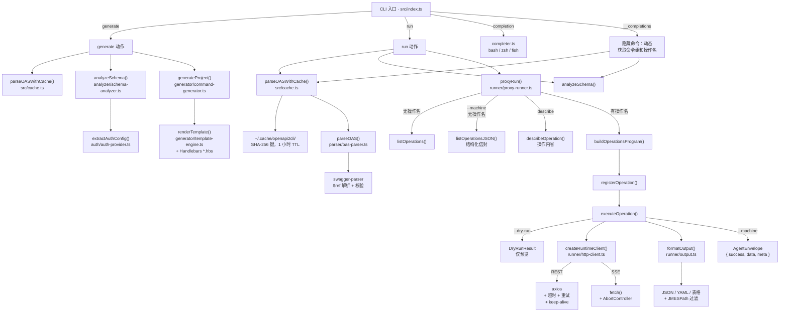

[English](./README.md) | 中文

# openapi2cli

两种模式，一个工具：

1. **generate（生成）** — 将 OpenAPI 3.x 规范脚手架为完整的 TypeScript CLI 项目
2. **run（直接代理）** — 无需生成代码，直接在命令行调用 OpenAPI 接口

## 架构图



## 功能特性

- 支持从**文件路径或 URL** 解析 OAS 3.x 规范（完整 `$ref` 解析）
- 按 **tag** 分组操作，生成 Commander 子命令组；未分组的操作注册为顶层命令
- 生成带完整类型标注的 **TypeScript 源码**，支持必填/可选参数、枚举 `.choices()` 校验
- **5 种认证方案**：生成模式从 OAS 安全定义自动检测；run 模式通过命令行参数传入
- **SSE 流式输出**基于 `eventsource-parser`，支持 `[DONE]` 哨兵处理
- **自动分页**：`--all-pages` 参数，自动跟随 `Link: rel="next"` 响应头翻页
- **JMESPath 过滤**：每条命令均支持 `--query` 参数
- **中文命令名支持**：中/日/韩 operationId 自动转换为拼音
- **OpenAPI 扩展**：`x-cli-name`、`x-cli-aliases`、`x-cli-ignore`、`x-cli-token-url`
- 自动生成**双语文档**：`README.md`（英文）+ `README.zh.md`（中文）+ `SKILL.md`
- **Agent 友好模式**（`--machine`）：结构化 JSON 信封输出，方便 AI 工具集成
- **操作内省**（`describe`）：发现参数、请求体结构、响应结构和认证要求
- **Dry-run 预览**（`--dry-run`）：验证计划的请求而不实际执行

## 安装

```bash
npm install -g @tronsfey/openapi2cli
```

## 使用方法

### run 模式（直接代理，无需生成代码）

授权信息通过命令行参数传入：

```bash
# 列出所有可用操作
openapi2cli run --oas ./openapi.yaml

# Bearer Token
openapi2cli run --oas ./openapi.yaml --bearer ghp_xxx repos get-repo --owner octocat --repo Hello-World

# API Key
openapi2cli run --oas ./openapi.yaml --api-key sk-xxx --api-key-header X-Api-Key pets list-pets

# HTTP Basic
openapi2cli run --oas ./openapi.yaml --basic user:pass users get-user --username alice

# 自定义请求头（可多次指定）
openapi2cli run --oas ./openapi.yaml --header "X-Request-Id: abc123" --header "X-Tenant: acme" ...

# 覆盖 Base URL
openapi2cli run --oas ./openapi.yaml --endpoint https://staging.example.com --bearer xxx ...

# 输出选项（在操作名称之后指定）
openapi2cli run --oas ./openapi.yaml repos list-repo-issues --owner octocat --repo Hello-World \
  --format table --query '[].title' --all-pages
```

### generate 模式（生成完整 CLI 项目）

```bash
# 从本地文件生成
openapi2cli generate --oas ./openapi.yaml --name my-api --output ./my-api-cli

# 从 URL 生成
openapi2cli generate --oas https://petstore3.swagger.io/api/v3/openapi.json --name petstore --output ./petstore-cli
```

构建并链接生成的项目：

```bash
cd my-api-cli
npm install && npm run build && npm link
my-api --help
```

## 示例

参见 [`examples/github-cli/`](./examples/github-cli/)，这是一个针对 GitHub REST API 的完整生成示例：

```bash
cd examples/github-cli
npm install && npm run build
node dist/index.js repos get-repo --owner octocat --repo Hello-World
node dist/index.js repos list-repo-issues --owner octocat --repo Hello-World --state open
node dist/index.js users get-user --username octocat
```

## 测试

本仓库同时包含单元测试，以及基于真实服务的端到端测试。

```bash
# 单元测试
npm test

# 生成型 CLI，对接本地真实 Express 服务
npm run test:e2e

# proxy 模式，对接本地真实 Express 服务
npm run test:proxy-e2e

# 运行全部本地真实服务端到端测试
npm run test:real-service
```

本地 E2E 测试会启动 `tests/server/server.ts` 中的真实 HTTP 服务，绑定到空闲的 localhost 端口，再让 CLI 直接请求这个在线服务；请求执行阶段不使用 HTTP mock。

## 生成项目结构

```
<output>/
├── bin/<name>            # 可执行文件 shebang 包装器
├── src/
│   ├── index.ts          # Commander 根程序 + 全局选项
│   ├── commands/
│   │   └── <tag>.ts      # 每个 OAS tag 对应一个文件
│   └── lib/
│       └── api-client.ts # 带认证 + SSE 流式支持的 axios 客户端
├── README.md             # 英文使用文档
├── README.zh.md          # 中文使用文档
├── SKILL.md              # Claude Code 技能描述文件
├── package.json
└── tsconfig.json
```

生成项目的运行时依赖：`axios`、`chalk`、`commander`、`eventsource-parser`、`jmespath`、`yaml`、`ora`。

## 认证方式

生成器自动检测 OAS 文档中的第一个安全方案，并生成对应的认证代码。运行 CLI 前设置相应的环境变量：

| 方案 | 环境变量 | 说明 |
|------|---------|------|
| Bearer | `<NAME>_TOKEN` | `Authorization: Bearer …` |
| API Key | `<NAME>_API_KEY` | Header 或 Query 参数，名称取自 OAS |
| HTTP Basic | `<NAME>_CREDENTIALS` | `用户名:密码` → Base64 编码 |
| OAuth2 Client Credentials | `<NAME>_CLIENT_ID`、`<NAME>_CLIENT_SECRET`、`<NAME>_SCOPES` | 启动时自动换取 Token，进程内缓存 |
| 动态 Token（`x-cli-token-url`） | 扩展字段中定义的自定义环境变量 | 以 JSON Body 请求 Token 端点 |

`<NAME>` 为 CLI 名称的大写下划线形式（如 `my-api` → `MY_API`）。

## OpenAPI 扩展

在 OAS 文档中添加以下厂商扩展，可控制 CLI 生成行为：

| 扩展字段 | 位置 | 效果 |
|----------|------|------|
| `x-cli-name: "my-name"` | operation | 覆盖自动生成的命令名 |
| `x-cli-aliases: ["a"]` | operation | 为命令添加 Commander 别名 |
| `x-cli-ignore: true` | operation | 从生成的 CLI 中排除该操作 |
| `x-cli-token-url: "https://…"` | securityScheme | 自定义动态认证 Token 端点 |

## 全局选项

所有生成的 CLI 的每条命令均支持以下全局选项：

| 选项 | 说明 | 默认值 |
|------|------|--------|
| `--endpoint <url>` | 覆盖 API 基础地址 | OAS 规范中的 server URL |
| `--format <fmt>` | 输出格式：`json`、`yaml`、`table` | `json` |
| `--verbose` | 打印每次请求的 HTTP 方法和 URL | `false` |
| `--query <expr>` | JMESPath 表达式，过滤响应结果 | — |
| `--all-pages` | 自动翻页（跟随 `Link: rel="next"` 响应头） | `false` |

## 请求体

`POST`、`PUT`、`PATCH` 命令使用 `--data` 传入请求体：

```bash
# 内联 JSON
my-api widgets create --data '{"name": "foo", "color": "blue"}'

# 从文件读取
my-api widgets create --data @./payload.json
```

## 输出格式

```bash
# 默认：格式化 JSON
my-api repos list

# 表格视图（适合数组类型数据）
my-api repos list --format table

# YAML 格式
my-api repos list --format yaml

# JMESPath 过滤
my-api repos list --query '[].name'

# 配合 jq 过滤
my-api repos list | jq '.[].full_name'

# 保存到文件
my-api repos list > repos.json
```

## 流式输出（SSE）

响应内容类型为 `text/event-stream` 的操作会被自动识别。生成的 CLI 将每个 SSE 数据载荷输出到 stdout，每行一条：

```bash
my-api completions create --model gpt-4o --stream
```

生成的客户端使用 `eventsource-parser`，支持多行 `data:` 载荷、命名 `event:` 类型，并静默丢弃 OpenAI 兼容 API 常用的 `[DONE]` 哨兵。

## Shell 自动补全

在 shell 中一次性 source 生成的补全脚本，即可启用 Tab 补全：

```bash
# Bash — 添加到 ~/.bashrc
eval "$(openapi2cli completion bash)"

# Zsh — 添加到 ~/.zshrc
eval "$(openapi2cli completion zsh)"

# Fish
openapi2cli completion fish > ~/.config/fish/completions/openapi2cli.fish
```

支持补全：
- 顶层命令（`generate`、`run`、`completion`）
- `generate` 和 `run` 的所有参数
- **动态操作名称** — 在 `run --oas <spec>` 之后，补全脚本会调用
  `openapi2cli __completions` 从规范中实时查找命令组和操作名称

## Agent 友好模式（AI 工具集成）

当用作 AI Agent 的工具（如 Claude Code、LangChain、AutoGPT）时，`run` 命令提供
`--machine` 和 `--dry-run` 标志，确保每个步骤都输出结构化的 JSON，方便 Agent 解析：

### 1. 发现可用操作

```bash
openapi2cli run --oas ./openapi.yaml --machine
# 返回: { "success": true, "data": { "totalOperations": 42, "operations": [...] } }
```

### 2. 检查具体操作

```bash
openapi2cli run --oas ./openapi.yaml --machine describe users get-user
# 返回: 参数定义、请求体结构、响应结构、认证要求、示例命令
```

### 3. 预览请求（dry-run）

```bash
openapi2cli run --oas ./openapi.yaml --dry-run users get-user --username alice
# 返回: { "method": "GET", "url": "https://api.example.com/users/alice", "headers": {...} }
# 不会发送 HTTP 请求 — 安全验证。
```

### 4. 执行并获取结构化输出

```bash
openapi2cli run --oas ./openapi.yaml --machine users get-user --username alice
# 返回: { "success": true, "data": {...}, "meta": { "durationMs": 42 } }
```

### 结构化错误输出

在 `--machine` 模式下，错误也以 JSON 信封形式返回，而非抛出异常：

```json
{
  "success": false,
  "error": {
    "type": "HttpClientError",
    "message": "[HTTP 404 Not Found] GET /users/unknown",
    "statusCode": 404,
    "hint": "Endpoint not found — verify the operation name and path params"
  }
}
```

## 命令行参考

```
openapi2cli generate [options]

  --oas <path|url>       OpenAPI 3.x 规范的文件路径或 URL（必填）
  --name <name>          CLI 可执行文件名称（必填）
  --output <dir>         输出目录（必填）
  --overwrite            覆盖已存在的输出目录
  --no-cache             跳过规范缓存（始终重新拉取远端规范）
  --cache-ttl <seconds>  缓存 TTL（秒），默认 3600
  -h, --help             显示帮助信息

openapi2cli run [options] [group] [operation] [operation-options]

  --oas <path|url>           OpenAPI 3.x 规范（必填）
  --bearer <token>           Authorization: Bearer <token>
  --api-key <key>            API Key 值
  --api-key-header <header>  API Key 的请求头名称（默认：X-Api-Key）
  --basic <user:pass>        HTTP Basic 凭证
  --header <Name: Value>     自定义请求头，可多次指定
  --endpoint <url>           覆盖规范中的 Base URL
  --timeout <ms>             请求超时（毫秒），默认 30000
  --retries <n>              5xx/网络错误的最大重试次数，默认 3
  --machine                  Agent 友好模式：所有输出为结构化 JSON 信封
  --dry-run                  预览 HTTP 请求但不执行（隐含 --machine）
  --no-cache                 跳过规范缓存（始终重新拉取远端规范）
  --cache-ttl <seconds>      缓存 TTL（秒），默认 3600
  -h, --help                 显示帮助信息

  内置子命令（在 group/operation 之前使用）：
  describe <group> <op>      检查操作的参数、请求体和认证要求

  操作级输出选项（在操作名称之后指定）：
  --format json|yaml|table   输出格式（默认：json）
  --query <jmespath>         JMESPath 表达式，过滤响应
  --all-pages                自动翻页（跟随 Link rel="next" 响应头）
  --verbose                  向 stderr 打印 HTTP 方法和 URL
```

### 规范缓存

远端 OAS 规范默认缓存到 `~/.cache/openapi2cli/`，TTL 1 小时。
首次加载后，后续调用几乎无延迟。

```bash
# 强制重新拉取（跳过缓存）
openapi2cli run --oas https://api.example.com/openapi.json --no-cache ...

# 延长缓存到 24 小时
openapi2cli run --oas https://api.example.com/openapi.json --cache-ttl 86400 ...
```

### 稳定性选项

```bash
# 为慢速 API 设置 60 秒超时
openapi2cli run --oas ./spec.yaml --timeout 60000 items list-items

# 禁用重试（出错立即失败）
openapi2cli run --oas ./spec.yaml --retries 0 items list-items
```

重试使用指数退避（500 ms → 1 s → 2 s），仅对可重试错误生效：
网络故障（`ECONNREFUSED`、`ETIMEDOUT`、`ECONNRESET`）及 HTTP 429、500、502、503、504。
非可重试的 4xx 错误（401、403、404、422 等）立即失败。

## 许可证

MIT
